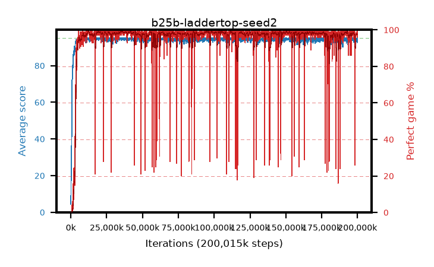

# b25b-laddertop-seed2

step **200,015,872** · 3052 evals · trailing **93.97** · peak **94.79** @36,044,800 · sef **96.7** · best30 **99.1** @35,979,264

## Config

| | |
|---|---|
| algo | ppo |
| collect_envs | 128 |
| discount | 0.999 |
| eval_interval | 65536 |
| eval_queue | True |
| eval_queue_depth | 16 |
| eval_workers | 8 |
| fc_layers | (320,) |
| graph_eval_episodes | 100 |
| max_steps | 200015872 |
| min_checkpoint_score | 40.0 |
| ppo_adam_epsilon | 1e-07 |
| ppo_anneal_fraction | 0.8 |
| ppo_clip | 0.2 |
| ppo_clip_final | 0.001 |
| ppo_discount_final | None |
| ppo_entropy_coef | 0.01 |
| ppo_entropy_coef_final | None |
| ppo_epochs | 4 |
| ppo_gae_lambda | 0.99 |
| ppo_gae_lambda_final | None |
| ppo_gradient_clipping | 0.5 |
| ppo_horizon | 91.0 |
| ppo_learning_rate | 0.0003 |
| ppo_learning_rate_final | None |
| ppo_minibatch | 256 |
| ppo_normalize_adv | True |
| ppo_rollout | 512 |
| ppo_target_kl | 0.0 |
| ppo_transitions_per_rollout | 65536 |
| ppo_value_loss | mse |
| ppo_vf_coef | 0.5 |
| seed | 2 |
| torch_threads | 1 |

## Evals

| step | avg score | trailing avg | min score | max score | avg reward | perfect % | epsilon |
|---|---|---|---|---|---|---|---|
| 65536 | 4.44 | 4.44 | 2.0 | 10.0 | -0.196 | 0.0 |  |
| 131072 | 14.08 | 9.26 | 5.0 | 26.0 | 9.133 | 0.0 |  |
| 196608 | 19.89 | 12.8 | 8.0 | 36.0 | 14.868 | 0.0 |  |
| ... | ... | ... | ... | ... | ... | ... | ... |
| 199294976 | 94.51 | 93.95 | 62.0 | 95.0 | 191.258 | 98.0 |  |
| 199360512 | 94.97 | 93.99 | 92.0 | 95.0 | 192.715 | 99.0 |  |
| 199426048 | 94.35 | 94.04 | 55.0 | 95.0 | 191.099 | 98.0 |  |
| 199491584 | 94.66 | 94.09 | 62.0 | 95.0 | 191.355 | 98.0 |  |
| 199557120 | 94.18 | 94.09 | 58.0 | 95.0 | 189.933 | 97.0 |  |
| 199622656 | 93.88 | 94.06 | 13.0 | 95.0 | 190.626 | 98.0 |  |
| 199688192 | 94.69 | 94.08 | 64.0 | 95.0 | 192.434 | 99.0 |  |
| 199753728 | 92.6 | 94.02 | 3.0 | 95.0 | 187.365 | 96.0 |  |
| 199819264 | 93.62 | 94.01 | 54.0 | 95.0 | 188.376 | 96.0 |  |
| 199884800 | 94.27 | 94.02 | 58.0 | 95.0 | 191.023 | 98.0 |  |
| 199950336 | 93.0 | 93.96 | 8.0 | 95.0 | 187.757 | 96.0 |  |
| 200015872 | 95.0 | 93.97 | 95.0 | 95.0 | 193.751 | 100.0 |  |
