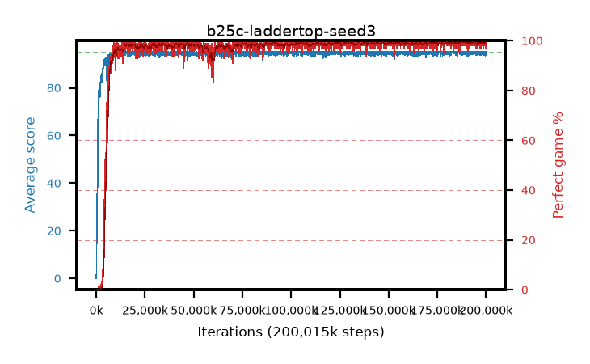

# b25c-laddertop-seed3

step **200,015,872** · 3052 evals · trailing **94.67** · peak **94.9** @184,287,232 · sef **96.9** · best30 **99.5** @188,940,288

## Config

| | |
|---|---|
| algo | ppo |
| collect_envs | 128 |
| discount | 0.999 |
| eval_interval | 65536 |
| eval_queue | True |
| eval_queue_depth | 16 |
| eval_workers | 8 |
| fc_layers | (320,) |
| graph_eval_episodes | 100 |
| max_steps | 200015872 |
| min_checkpoint_score | 40.0 |
| ppo_adam_epsilon | 1e-07 |
| ppo_anneal_fraction | 0.8 |
| ppo_clip | 0.2 |
| ppo_clip_final | 0.001 |
| ppo_discount_final | None |
| ppo_entropy_coef | 0.01 |
| ppo_entropy_coef_final | None |
| ppo_epochs | 4 |
| ppo_gae_lambda | 0.99 |
| ppo_gae_lambda_final | None |
| ppo_gradient_clipping | 0.5 |
| ppo_horizon | 91.0 |
| ppo_learning_rate | 0.0003 |
| ppo_learning_rate_final | None |
| ppo_minibatch | 256 |
| ppo_normalize_adv | True |
| ppo_rollout | 512 |
| ppo_target_kl | 0.0 |
| ppo_transitions_per_rollout | 65536 |
| ppo_value_loss | mse |
| ppo_vf_coef | 0.5 |
| seed | 3 |
| torch_threads | 1 |

## Evals

| step | avg score | trailing avg | min score | max score | avg reward | perfect % | epsilon |
|---|---|---|---|---|---|---|---|
| 65536 | 0.03 | 0.03 | 0.0 | 1.0 | -4.215 | 0.0 |  |
| 131072 | 2.5 | 1.26 | 0.0 | 9.0 | 1.137 | 0.0 |  |
| 196608 | 20.3 | 7.61 | 5.0 | 34.0 | 15.277 | 0.0 |  |
| ... | ... | ... | ... | ... | ... | ... | ... |
| 199294976 | 95.0 | 94.76 | 95.0 | 95.0 | 193.748 | 100.0 |  |
| 199360512 | 94.08 | 94.74 | 16.0 | 95.0 | 190.789 | 98.0 |  |
| 199426048 | 94.76 | 94.78 | 71.0 | 95.0 | 192.505 | 99.0 |  |
| 199491584 | 94.85 | 94.77 | 80.0 | 95.0 | 192.598 | 99.0 |  |
| 199557120 | 94.12 | 94.75 | 12.0 | 95.0 | 190.87 | 98.0 |  |
| 199622656 | 94.21 | 94.72 | 16.0 | 95.0 | 191.96 | 99.0 |  |
| 199688192 | 94.65 | 94.71 | 60.0 | 95.0 | 192.391 | 99.0 |  |
| 199753728 | 93.49 | 94.67 | 14.0 | 95.0 | 189.246 | 97.0 |  |
| 199819264 | 93.82 | 94.63 | 14.0 | 95.0 | 190.57 | 98.0 |  |
| 199884800 | 94.97 | 94.63 | 92.0 | 95.0 | 192.717 | 99.0 |  |
| 199950336 | 95.0 | 94.63 | 95.0 | 95.0 | 193.741 | 100.0 |  |
| 200015872 | 95.0 | 94.67 | 95.0 | 95.0 | 193.742 | 100.0 |  |
