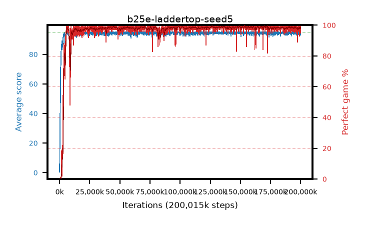

# b25e-laddertop-seed5

step **200,015,872** · 3052 evals · trailing **94.35** · peak **94.8** @127,074,304 · sef **97.5** · best30 **99.3** @127,139,840

## Config

| | |
|---|---|
| algo | ppo |
| collect_envs | 128 |
| discount | 0.999 |
| eval_interval | 65536 |
| eval_queue | True |
| eval_queue_depth | 16 |
| eval_workers | 8 |
| fc_layers | (320,) |
| graph_eval_episodes | 100 |
| max_steps | 200015872 |
| min_checkpoint_score | 40.0 |
| ppo_adam_epsilon | 1e-07 |
| ppo_anneal_fraction | 0.8 |
| ppo_clip | 0.2 |
| ppo_clip_final | 0.001 |
| ppo_discount_final | None |
| ppo_entropy_coef | 0.01 |
| ppo_entropy_coef_final | None |
| ppo_epochs | 4 |
| ppo_gae_lambda | 0.99 |
| ppo_gae_lambda_final | None |
| ppo_gradient_clipping | 0.5 |
| ppo_horizon | 91.0 |
| ppo_learning_rate | 0.0003 |
| ppo_learning_rate_final | None |
| ppo_minibatch | 256 |
| ppo_normalize_adv | True |
| ppo_rollout | 512 |
| ppo_target_kl | 0.0 |
| ppo_transitions_per_rollout | 65536 |
| ppo_value_loss | mse |
| ppo_vf_coef | 0.5 |
| seed | 5 |
| torch_threads | 1 |

## Evals

| step | avg score | trailing avg | min score | max score | avg reward | perfect % | epsilon |
|---|---|---|---|---|---|---|---|
| 65536 | 0.4 | 0.4 | 0.0 | 3.0 | -4.603 | 0.0 |  |
| 131072 | 13.78 | 7.09 | 1.0 | 34.0 | 8.985 | 0.0 |  |
| 196608 | 19.17 | 11.12 | 5.0 | 41.0 | 14.154 | 0.0 |  |
| ... | ... | ... | ... | ... | ... | ... | ... |
| 199294976 | 93.95 | 94.36 | 58.0 | 95.0 | 188.664 | 96.0 |  |
| 199360512 | 93.8 | 94.35 | 12.0 | 95.0 | 190.56 | 98.0 |  |
| 199426048 | 94.67 | 94.35 | 62.0 | 95.0 | 192.408 | 99.0 |  |
| 199491584 | 94.69 | 94.36 | 64.0 | 95.0 | 192.437 | 99.0 |  |
| 199557120 | 94.88 | 94.35 | 83.0 | 95.0 | 192.58 | 99.0 |  |
| 199622656 | 94.13 | 94.33 | 8.0 | 95.0 | 191.878 | 99.0 |  |
| 199688192 | 94.31 | 94.33 | 54.0 | 95.0 | 191.02 | 98.0 |  |
| 199753728 | 93.73 | 94.33 | 12.0 | 95.0 | 189.483 | 97.0 |  |
| 199819264 | 95.0 | 94.38 | 95.0 | 95.0 | 193.736 | 100.0 |  |
| 199884800 | 94.03 | 94.36 | 60.0 | 95.0 | 189.781 | 97.0 |  |
| 199950336 | 93.11 | 94.3 | 12.0 | 95.0 | 186.87 | 95.0 |  |
| 200015872 | 95.0 | 94.35 | 95.0 | 95.0 | 193.737 | 100.0 |  |
