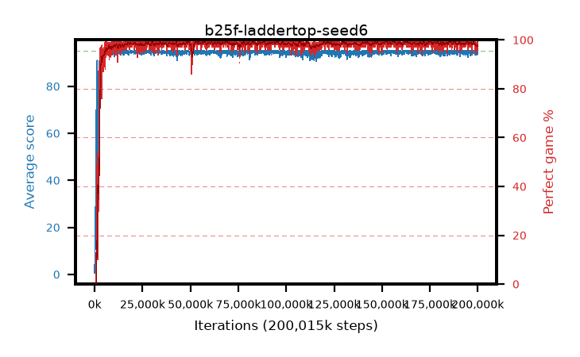

# b25f-laddertop-seed6

step **200,015,872** · 3052 evals · trailing **94.27** · peak **94.75** @27,918,336 · sef **98.8** · best30 **99.2** @156,762,112

## Config

| | |
|---|---|
| algo | ppo |
| collect_envs | 128 |
| discount | 0.999 |
| eval_interval | 65536 |
| eval_queue | True |
| eval_queue_depth | 16 |
| eval_workers | 8 |
| fc_layers | (320,) |
| graph_eval_episodes | 100 |
| max_steps | 200015872 |
| min_checkpoint_score | 40.0 |
| ppo_adam_epsilon | 1e-07 |
| ppo_anneal_fraction | 0.8 |
| ppo_clip | 0.2 |
| ppo_clip_final | 0.001 |
| ppo_discount_final | None |
| ppo_entropy_coef | 0.01 |
| ppo_entropy_coef_final | None |
| ppo_epochs | 4 |
| ppo_gae_lambda | 0.99 |
| ppo_gae_lambda_final | None |
| ppo_gradient_clipping | 0.5 |
| ppo_horizon | 91.0 |
| ppo_learning_rate | 0.0003 |
| ppo_learning_rate_final | None |
| ppo_minibatch | 256 |
| ppo_normalize_adv | True |
| ppo_rollout | 512 |
| ppo_target_kl | 0.0 |
| ppo_transitions_per_rollout | 65536 |
| ppo_value_loss | mse |
| ppo_vf_coef | 0.5 |
| seed | 6 |
| torch_threads | 1 |

## Evals

| step | avg score | trailing avg | min score | max score | avg reward | perfect % | epsilon |
|---|---|---|---|---|---|---|---|
| 65536 | 0.59 | 0.59 | 0.0 | 5.0 | 0.036 | 0.0 |  |
| 131072 | 5.93 | 6.32 | 1.0 | 25.0 | 4.72 | 0.0 |  |
| 196608 | 12.44 | 6.51 | 3.0 | 35.0 | 7.689 | 0.0 |  |
| ... | ... | ... | ... | ... | ... | ... | ... |
| 199294976 | 93.66 | 94.31 | 18.0 | 95.0 | 188.405 | 96.0 |  |
| 199360512 | 94.72 | 94.3 | 75.0 | 95.0 | 191.411 | 98.0 |  |
| 199426048 | 93.98 | 94.26 | 24.0 | 95.0 | 189.669 | 97.0 |  |
| 199491584 | 94.68 | 94.26 | 63.0 | 95.0 | 192.426 | 99.0 |  |
| 199557120 | 94.77 | 94.26 | 78.0 | 95.0 | 190.426 | 97.0 |  |
| 199622656 | 93.97 | 94.23 | 24.0 | 95.0 | 189.72 | 97.0 |  |
| 199688192 | 93.23 | 94.2 | 16.0 | 95.0 | 186.854 | 95.0 |  |
| 199753728 | 94.9 | 94.19 | 85.0 | 95.0 | 192.597 | 99.0 |  |
| 199819264 | 94.01 | 94.2 | 24.0 | 95.0 | 190.75 | 98.0 |  |
| 199884800 | 95.0 | 94.22 | 95.0 | 95.0 | 193.735 | 100.0 |  |
| 199950336 | 94.72 | 94.24 | 67.0 | 95.0 | 192.459 | 99.0 |  |
| 200015872 | 95.0 | 94.27 | 95.0 | 95.0 | 193.733 | 100.0 |  |
