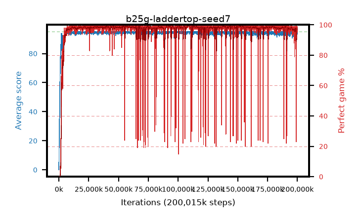

# b25g-laddertop-seed7

step **200,015,872** · 3052 evals · trailing **93.94** · peak **94.83** @109,117,440 · sef **96.6** · best30 **99.2** @109,248,512

## Config

| | |
|---|---|
| algo | ppo |
| collect_envs | 128 |
| discount | 0.999 |
| eval_interval | 65536 |
| eval_queue | True |
| eval_queue_depth | 16 |
| eval_workers | 8 |
| fc_layers | (320,) |
| graph_eval_episodes | 100 |
| max_steps | 200015872 |
| min_checkpoint_score | 40.0 |
| ppo_adam_epsilon | 1e-07 |
| ppo_anneal_fraction | 0.8 |
| ppo_clip | 0.2 |
| ppo_clip_final | 0.001 |
| ppo_discount_final | None |
| ppo_entropy_coef | 0.01 |
| ppo_entropy_coef_final | None |
| ppo_epochs | 4 |
| ppo_gae_lambda | 0.99 |
| ppo_gae_lambda_final | None |
| ppo_gradient_clipping | 0.5 |
| ppo_horizon | 91.0 |
| ppo_learning_rate | 0.0003 |
| ppo_learning_rate_final | None |
| ppo_minibatch | 256 |
| ppo_normalize_adv | True |
| ppo_rollout | 512 |
| ppo_target_kl | 0.0 |
| ppo_transitions_per_rollout | 65536 |
| ppo_value_loss | mse |
| ppo_vf_coef | 0.5 |
| seed | 7 |
| torch_threads | 1 |

## Evals

| step | avg score | trailing avg | min score | max score | avg reward | perfect % | epsilon |
|---|---|---|---|---|---|---|---|
| 65536 | 0.02 | 0.02 | 0.0 | 1.0 | -4.981 | 0.0 |  |
| 131072 | 13.0 | 6.51 | 0.0 | 27.0 | 8.432 | 0.0 |  |
| 196608 | 18.04 | 10.35 | 3.0 | 37.0 | 13.012 | 0.0 |  |
| ... | ... | ... | ... | ... | ... | ... | ... |
| 199294976 | 94.51 | 93.78 | 60.0 | 95.0 | 191.211 | 98.0 |  |
| 199360512 | 93.72 | 93.78 | 16.0 | 95.0 | 189.427 | 97.0 |  |
| 199426048 | 94.65 | 93.82 | 60.0 | 95.0 | 192.398 | 99.0 |  |
| 199491584 | 93.42 | 93.85 | 54.0 | 95.0 | 187.171 | 95.0 |  |
| 199557120 | 93.13 | 93.84 | 3.0 | 95.0 | 188.883 | 97.0 |  |
| 199622656 | 93.17 | 93.85 | 20.0 | 95.0 | 187.933 | 96.0 |  |
| 199688192 | 94.65 | 93.85 | 60.0 | 95.0 | 192.394 | 99.0 |  |
| 199753728 | 93.15 | 93.84 | 14.0 | 95.0 | 186.91 | 95.0 |  |
| 199819264 | 94.04 | 93.89 | 38.0 | 95.0 | 189.788 | 97.0 |  |
| 199884800 | 94.65 | 93.89 | 60.0 | 95.0 | 192.354 | 99.0 |  |
| 199950336 | 94.08 | 93.91 | 60.0 | 95.0 | 189.829 | 97.0 |  |
| 200015872 | 93.66 | 93.94 | 2.0 | 95.0 | 190.411 | 98.0 |  |
