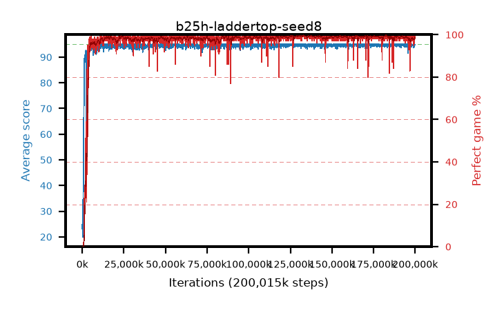

# b25h-laddertop-seed8

step **200,015,872** · 3052 evals · trailing **94.64** · peak **94.9** @126,353,408 · sef **98.4** · best30 **99.6** @183,042,048

## Config

| | |
|---|---|
| algo | ppo |
| collect_envs | 128 |
| discount | 0.999 |
| eval_interval | 65536 |
| eval_queue | True |
| eval_queue_depth | 16 |
| eval_workers | 8 |
| fc_layers | (320,) |
| graph_eval_episodes | 100 |
| max_steps | 200015872 |
| min_checkpoint_score | 40.0 |
| ppo_adam_epsilon | 1e-07 |
| ppo_anneal_fraction | 0.8 |
| ppo_clip | 0.2 |
| ppo_clip_final | 0.001 |
| ppo_discount_final | None |
| ppo_entropy_coef | 0.01 |
| ppo_entropy_coef_final | None |
| ppo_epochs | 4 |
| ppo_gae_lambda | 0.99 |
| ppo_gae_lambda_final | None |
| ppo_gradient_clipping | 0.5 |
| ppo_horizon | 91.0 |
| ppo_learning_rate | 0.0003 |
| ppo_learning_rate_final | None |
| ppo_minibatch | 256 |
| ppo_normalize_adv | True |
| ppo_rollout | 512 |
| ppo_target_kl | 0.0 |
| ppo_transitions_per_rollout | 65536 |
| ppo_value_loss | mse |
| ppo_vf_coef | 0.5 |
| seed | 8 |
| torch_threads | 1 |

## Evals

| step | avg score | trailing avg | min score | max score | avg reward | perfect % | epsilon |
|---|---|---|---|---|---|---|---|
| 65536 | 23.05 | 23.05 | 4.0 | 42.0 | 17.942 | 0.0 |  |
| 131072 | 26.08 | 23.02 | 1.0 | 57.0 | 21.796 | 0.0 |  |
| 196608 | 19.93 | 21.49 | 2.0 | 39.0 | 14.91 | 0.0 |  |
| ... | ... | ... | ... | ... | ... | ... | ... |
| 199294976 | 94.81 | 94.7 | 76.0 | 95.0 | 192.546 | 99.0 |  |
| 199360512 | 94.1 | 94.68 | 22.0 | 95.0 | 190.854 | 98.0 |  |
| 199426048 | 93.92 | 94.65 | 12.0 | 95.0 | 188.672 | 96.0 |  |
| 199491584 | 94.07 | 94.62 | 16.0 | 95.0 | 190.818 | 98.0 |  |
| 199557120 | 94.82 | 94.62 | 77.0 | 95.0 | 192.565 | 99.0 |  |
| 199622656 | 93.94 | 94.58 | 6.0 | 95.0 | 190.686 | 98.0 |  |
| 199688192 | 95.0 | 94.61 | 95.0 | 95.0 | 193.745 | 100.0 |  |
| 199753728 | 95.0 | 94.65 | 95.0 | 95.0 | 193.724 | 100.0 |  |
| 199819264 | 95.0 | 94.62 | 95.0 | 95.0 | 193.734 | 100.0 |  |
| 199884800 | 94.82 | 94.65 | 80.0 | 95.0 | 191.561 | 98.0 |  |
| 199950336 | 94.86 | 94.65 | 81.0 | 95.0 | 192.593 | 99.0 |  |
| 200015872 | 94.72 | 94.64 | 75.0 | 95.0 | 191.461 | 98.0 |  |
