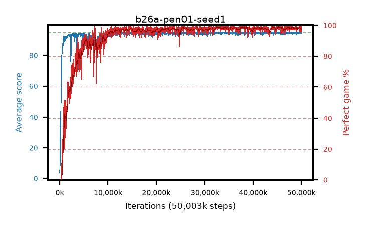

# b26a-pen01-seed1

step **50,003,968** · 1526 evals · trailing **94.5** · peak **94.72** @45,809,664 · sef **91.2** · best30 **98.9** @45,809,664

## Config

| | |
|---|---|
| algo | ppo |
| collect_envs | 128 |
| discount | 0.99 |
| eval_interval | 32768 |
| eval_queue | True |
| eval_queue_depth | 16 |
| eval_workers | 8 |
| fc_layers | (320,) |
| graph_eval_episodes | 100 |
| max_steps | 50003968 |
| min_checkpoint_score | 40.0 |
| ppo_adam_epsilon | 1e-07 |
| ppo_anneal_fraction | 0.5 |
| ppo_clip | 0.2 |
| ppo_clip_final | None |
| ppo_discount_final | 0.999 |
| ppo_entropy_coef | 0.01 |
| ppo_entropy_coef_final | 0.001 |
| ppo_epochs | 4 |
| ppo_gae_lambda | 0.95 |
| ppo_gae_lambda_final | 0.999 |
| ppo_gradient_clipping | 0.5 |
| ppo_horizon | 16.8 |
| ppo_horizon_final | 500.3 |
| ppo_learning_rate | 0.00025 |
| ppo_learning_rate_final | None |
| ppo_minibatch | 512 |
| ppo_normalize_adv | True |
| ppo_rollout | 256 |
| ppo_target_kl | 0.0 |
| ppo_transitions_per_rollout | 32768 |
| ppo_value_loss | huber |
| ppo_vf_coef | 0.5 |
| seed | 1 |
| torch_threads | 1 |

## Evals

| step | avg score | trailing avg | min score | max score | avg reward | perfect % | epsilon |
|---|---|---|---|---|---|---|---|
| 32768 | 3.69 | 3.69 | 0.0 | 9.0 | -0.983 | 0.0 |  |
| 65536 | 9.34 | 6.51 | 1.0 | 25.0 | 8.009 | 0.0 |  |
| 98304 | 22.27 | 11.77 | 1.0 | 48.0 | 17.997 | 0.0 |  |
| ... | ... | ... | ... | ... | ... | ... | ... |
| 49643520 | 95.0 | 94.54 | 95.0 | 95.0 | 193.711 | 100.0 |  |
| 49676288 | 94.06 | 94.51 | 12.0 | 95.0 | 190.787 | 98.0 |  |
| 49709056 | 94.44 | 94.53 | 79.0 | 95.0 | 188.123 | 95.0 |  |
| 49741824 | 94.57 | 94.54 | 65.0 | 95.0 | 190.292 | 97.0 |  |
| 49774592 | 94.72 | 94.51 | 74.0 | 95.0 | 191.44 | 98.0 |  |
| 49807360 | 94.43 | 94.53 | 71.0 | 95.0 | 189.149 | 96.0 |  |
| 49840128 | 94.98 | 94.52 | 93.0 | 95.0 | 192.693 | 99.0 |  |
| 49872896 | 94.72 | 94.53 | 67.0 | 95.0 | 192.431 | 99.0 |  |
| 49905664 | 94.06 | 94.52 | 34.0 | 95.0 | 189.785 | 97.0 |  |
| 49938432 | 94.97 | 94.52 | 92.0 | 95.0 | 192.674 | 99.0 |  |
| 49971200 | 94.03 | 94.49 | 64.0 | 95.0 | 188.769 | 96.0 |  |
| 50003968 | 94.71 | 94.5 | 66.0 | 95.0 | 192.417 | 99.0 |  |
