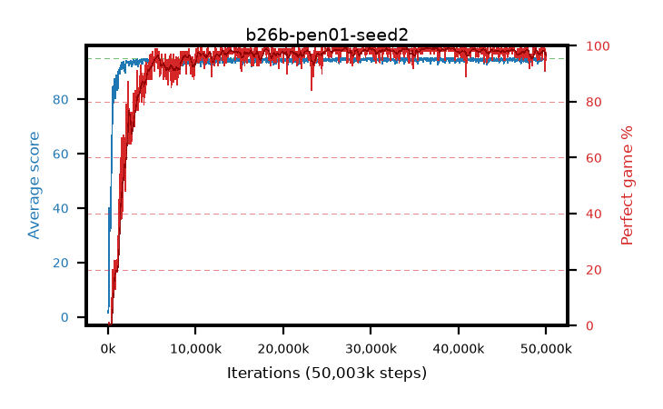

# b26b-pen01-seed2

step **50,003,968** · 1526 evals · trailing **94.46** · peak **94.74** @30,081,024 · sef **93.8** · best30 **99.1** @37,060,608

## Config

| | |
|---|---|
| algo | ppo |
| collect_envs | 128 |
| discount | 0.99 |
| eval_interval | 32768 |
| eval_queue | True |
| eval_queue_depth | 16 |
| eval_workers | 8 |
| fc_layers | (320,) |
| graph_eval_episodes | 100 |
| max_steps | 50003968 |
| min_checkpoint_score | 40.0 |
| ppo_adam_epsilon | 1e-07 |
| ppo_anneal_fraction | 0.5 |
| ppo_clip | 0.2 |
| ppo_clip_final | None |
| ppo_discount_final | 0.999 |
| ppo_entropy_coef | 0.01 |
| ppo_entropy_coef_final | 0.001 |
| ppo_epochs | 4 |
| ppo_gae_lambda | 0.95 |
| ppo_gae_lambda_final | 0.999 |
| ppo_gradient_clipping | 0.5 |
| ppo_horizon | 16.8 |
| ppo_horizon_final | 500.3 |
| ppo_learning_rate | 0.00025 |
| ppo_learning_rate_final | None |
| ppo_minibatch | 512 |
| ppo_normalize_adv | True |
| ppo_rollout | 256 |
| ppo_target_kl | 0.0 |
| ppo_transitions_per_rollout | 32768 |
| ppo_value_loss | huber |
| ppo_vf_coef | 0.5 |
| seed | 2 |
| torch_threads | 1 |

## Evals

| step | avg score | trailing avg | min score | max score | avg reward | perfect % | epsilon |
|---|---|---|---|---|---|---|---|
| 32768 | 1.55 | 1.55 | 0.0 | 8.0 | 0.954 | 0.0 |  |
| 65536 | 4.35 | 21.7 | 0.0 | 43.0 | 3.74 | 0.0 |  |
| 98304 | 40.01 | 26.72 | 7.0 | 95.0 | 36.047 | 1.0 |  |
| ... | ... | ... | ... | ... | ... | ... | ... |
| 49643520 | 94.84 | 94.54 | 79.0 | 95.0 | 192.563 | 99.0 |  |
| 49676288 | 94.93 | 94.52 | 88.0 | 95.0 | 192.658 | 99.0 |  |
| 49709056 | 94.82 | 94.52 | 80.0 | 95.0 | 191.555 | 98.0 |  |
| 49741824 | 94.58 | 94.49 | 67.0 | 95.0 | 191.305 | 98.0 |  |
| 49774592 | 94.96 | 94.51 | 91.0 | 95.0 | 192.682 | 99.0 |  |
| 49807360 | 94.91 | 94.51 | 86.0 | 95.0 | 192.631 | 99.0 |  |
| 49840128 | 93.81 | 94.5 | 71.0 | 95.0 | 184.549 | 92.0 |  |
| 49872896 | 93.82 | 94.48 | 73.0 | 95.0 | 183.549 | 91.0 |  |
| 49905664 | 94.94 | 94.52 | 89.0 | 95.0 | 192.659 | 99.0 |  |
| 49938432 | 94.61 | 94.49 | 78.0 | 95.0 | 190.331 | 97.0 |  |
| 49971200 | 94.47 | 94.47 | 78.0 | 95.0 | 188.199 | 95.0 |  |
| 50003968 | 94.62 | 94.46 | 77.0 | 95.0 | 190.309 | 97.0 |  |
