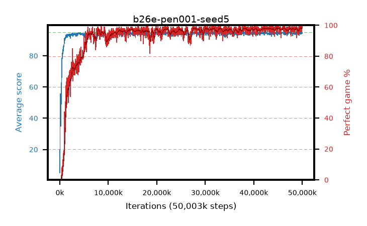

# b26e-pen001-seed5

step **50,003,968** · 1526 evals · trailing **94.45** · peak **94.53** @46,530,560 · sef **91.2** · best30 **98.1** @42,762,240

## Config

| | |
|---|---|
| algo | ppo |
| collect_envs | 128 |
| discount | 0.99 |
| eval_interval | 32768 |
| eval_queue | True |
| eval_queue_depth | 16 |
| eval_workers | 8 |
| fc_layers | (320,) |
| graph_eval_episodes | 100 |
| max_steps | 50003968 |
| min_checkpoint_score | 40.0 |
| ppo_adam_epsilon | 1e-07 |
| ppo_anneal_fraction | 0.5 |
| ppo_clip | 0.2 |
| ppo_clip_final | None |
| ppo_discount_final | 0.999 |
| ppo_entropy_coef | 0.01 |
| ppo_entropy_coef_final | 0.001 |
| ppo_epochs | 4 |
| ppo_gae_lambda | 0.95 |
| ppo_gae_lambda_final | 0.999 |
| ppo_gradient_clipping | 0.5 |
| ppo_horizon | 16.8 |
| ppo_horizon_final | 500.3 |
| ppo_learning_rate | 0.00025 |
| ppo_learning_rate_final | None |
| ppo_minibatch | 512 |
| ppo_normalize_adv | True |
| ppo_rollout | 256 |
| ppo_target_kl | 0.0 |
| ppo_transitions_per_rollout | 32768 |
| ppo_value_loss | huber |
| ppo_vf_coef | 0.5 |
| seed | 5 |
| torch_threads | 1 |

## Evals

| step | avg score | trailing avg | min score | max score | avg reward | perfect % | epsilon |
|---|---|---|---|---|---|---|---|
| 32768 | 5.02 | 31.36 | 0.0 | 44.0 | 3.832 | 0.0 |  |
| 65536 | 55.53 | 38.69 | 25.0 | 82.0 | 51.058 | 0.0 |  |
| 98304 | 50.7 | 50.7 | 22.0 | 76.0 | 45.55 | 0.0 |  |
| ... | ... | ... | ... | ... | ... | ... | ... |
| 49643520 | 94.15 | 94.44 | 10.0 | 95.0 | 191.877 | 99.0 |  |
| 49676288 | 93.67 | 94.39 | 10.0 | 95.0 | 189.401 | 97.0 |  |
| 49709056 | 95.0 | 94.39 | 95.0 | 95.0 | 193.729 | 100.0 |  |
| 49741824 | 95.0 | 94.39 | 95.0 | 95.0 | 193.726 | 100.0 |  |
| 49774592 | 94.75 | 94.41 | 79.0 | 95.0 | 191.476 | 98.0 |  |
| 49807360 | 94.15 | 94.4 | 57.0 | 95.0 | 188.876 | 96.0 |  |
| 49840128 | 94.25 | 94.44 | 58.0 | 95.0 | 189.971 | 97.0 |  |
| 49872896 | 94.08 | 94.44 | 57.0 | 95.0 | 188.815 | 96.0 |  |
| 49905664 | 94.49 | 94.44 | 62.0 | 95.0 | 191.202 | 98.0 |  |
| 49938432 | 94.75 | 94.45 | 70.0 | 95.0 | 192.464 | 99.0 |  |
| 49971200 | 94.82 | 94.43 | 77.0 | 95.0 | 192.524 | 99.0 |  |
| 50003968 | 94.63 | 94.45 | 75.0 | 95.0 | 191.335 | 98.0 |  |
