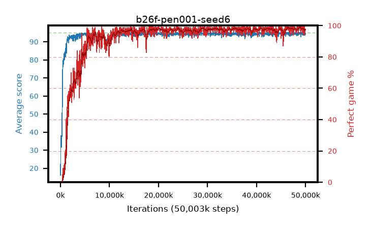

# b26f-pen001-seed6

step **50,003,968** · 1526 evals · trailing **94.3** · peak **94.6** @46,661,632 · sef **90.9** · best30 **98.4** @49,250,304

## Config

| | |
|---|---|
| algo | ppo |
| collect_envs | 128 |
| discount | 0.99 |
| eval_interval | 32768 |
| eval_queue | True |
| eval_queue_depth | 16 |
| eval_workers | 8 |
| fc_layers | (320,) |
| graph_eval_episodes | 100 |
| max_steps | 50003968 |
| min_checkpoint_score | 40.0 |
| ppo_adam_epsilon | 1e-07 |
| ppo_anneal_fraction | 0.5 |
| ppo_clip | 0.2 |
| ppo_clip_final | None |
| ppo_discount_final | 0.999 |
| ppo_entropy_coef | 0.01 |
| ppo_entropy_coef_final | 0.001 |
| ppo_epochs | 4 |
| ppo_gae_lambda | 0.95 |
| ppo_gae_lambda_final | 0.999 |
| ppo_gradient_clipping | 0.5 |
| ppo_horizon | 16.8 |
| ppo_horizon_final | 500.3 |
| ppo_learning_rate | 0.00025 |
| ppo_learning_rate_final | None |
| ppo_minibatch | 512 |
| ppo_normalize_adv | True |
| ppo_rollout | 256 |
| ppo_target_kl | 0.0 |
| ppo_transitions_per_rollout | 32768 |
| ppo_value_loss | huber |
| ppo_vf_coef | 0.5 |
| seed | 6 |
| torch_threads | 1 |

## Evals

| step | avg score | trailing avg | min score | max score | avg reward | perfect % | epsilon |
|---|---|---|---|---|---|---|---|
| 32768 | 16.19 | 16.19 | 2.0 | 34.0 | 11.204 | 0.0 |  |
| 65536 | 36.59 | 28.21 | 16.0 | 68.0 | 31.532 | 0.0 |  |
| 98304 | 37.96 | 30.65 | 8.0 | 63.0 | 32.864 | 0.0 |  |
| ... | ... | ... | ... | ... | ... | ... | ... |
| 49643520 | 94.1 | 94.37 | 61.0 | 95.0 | 188.838 | 96.0 |  |
| 49676288 | 93.94 | 94.42 | 20.0 | 95.0 | 190.661 | 98.0 |  |
| 49709056 | 95.0 | 94.37 | 95.0 | 95.0 | 193.723 | 100.0 |  |
| 49741824 | 94.7 | 94.37 | 65.0 | 95.0 | 192.423 | 99.0 |  |
| 49774592 | 94.95 | 94.32 | 90.0 | 95.0 | 192.674 | 99.0 |  |
| 49807360 | 94.17 | 94.33 | 60.0 | 95.0 | 188.909 | 96.0 |  |
| 49840128 | 93.75 | 94.33 | 58.0 | 95.0 | 187.443 | 95.0 |  |
| 49872896 | 94.42 | 94.33 | 44.0 | 95.0 | 191.147 | 98.0 |  |
| 49905664 | 94.31 | 94.3 | 68.0 | 95.0 | 190.035 | 97.0 |  |
| 49938432 | 94.05 | 94.29 | 57.0 | 95.0 | 189.778 | 97.0 |  |
| 49971200 | 94.5 | 94.3 | 66.0 | 95.0 | 190.222 | 97.0 |  |
| 50003968 | 94.3 | 94.3 | 70.0 | 95.0 | 190.027 | 97.0 |  |
