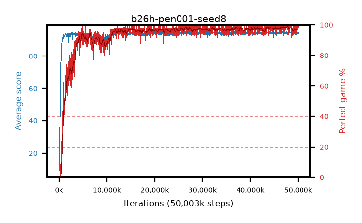

# b26h-pen001-seed8

step **50,003,968** · 1526 evals · trailing **94.39** · peak **94.65** @46,366,720 · sef **93.8** · best30 **98.5** @47,808,512

## Config

| | |
|---|---|
| algo | ppo |
| collect_envs | 128 |
| discount | 0.99 |
| eval_interval | 32768 |
| eval_queue | True |
| eval_queue_depth | 16 |
| eval_workers | 8 |
| fc_layers | (320,) |
| graph_eval_episodes | 100 |
| max_steps | 50003968 |
| min_checkpoint_score | 40.0 |
| ppo_adam_epsilon | 1e-07 |
| ppo_anneal_fraction | 0.5 |
| ppo_clip | 0.2 |
| ppo_clip_final | None |
| ppo_discount_final | 0.999 |
| ppo_entropy_coef | 0.01 |
| ppo_entropy_coef_final | 0.001 |
| ppo_epochs | 4 |
| ppo_gae_lambda | 0.95 |
| ppo_gae_lambda_final | 0.999 |
| ppo_gradient_clipping | 0.5 |
| ppo_horizon | 16.8 |
| ppo_horizon_final | 500.3 |
| ppo_learning_rate | 0.00025 |
| ppo_learning_rate_final | None |
| ppo_minibatch | 512 |
| ppo_normalize_adv | True |
| ppo_rollout | 256 |
| ppo_target_kl | 0.0 |
| ppo_transitions_per_rollout | 32768 |
| ppo_value_loss | huber |
| ppo_vf_coef | 0.5 |
| seed | 8 |
| torch_threads | 1 |

## Evals

| step | avg score | trailing avg | min score | max score | avg reward | perfect % | epsilon |
|---|---|---|---|---|---|---|---|
| 32768 | 9.15 | 9.15 | 0.0 | 26.0 | 7.381 | 0.0 |  |
| 65536 | 24.32 | 26.72 | 2.0 | 69.0 | 21.912 | 0.0 |  |
| 98304 | 35.59 | 22.37 | 10.0 | 69.0 | 30.563 | 0.0 |  |
| ... | ... | ... | ... | ... | ... | ... | ... |
| 49643520 | 94.8 | 94.25 | 85.0 | 95.0 | 190.539 | 97.0 |  |
| 49676288 | 94.1 | 94.22 | 20.0 | 95.0 | 190.835 | 98.0 |  |
| 49709056 | 93.81 | 94.23 | 8.0 | 95.0 | 190.539 | 98.0 |  |
| 49741824 | 94.54 | 94.25 | 73.0 | 95.0 | 190.265 | 97.0 |  |
| 49774592 | 94.84 | 94.27 | 82.0 | 95.0 | 191.57 | 98.0 |  |
| 49807360 | 94.43 | 94.27 | 66.0 | 95.0 | 191.168 | 98.0 |  |
| 49840128 | 94.77 | 94.29 | 72.0 | 95.0 | 192.493 | 99.0 |  |
| 49872896 | 94.25 | 94.3 | 63.0 | 95.0 | 189.988 | 97.0 |  |
| 49905664 | 94.65 | 94.29 | 60.0 | 95.0 | 192.375 | 99.0 |  |
| 49938432 | 94.81 | 94.34 | 81.0 | 95.0 | 191.535 | 98.0 |  |
| 49971200 | 94.96 | 94.36 | 91.0 | 95.0 | 192.693 | 99.0 |  |
| 50003968 | 94.29 | 94.39 | 36.0 | 95.0 | 190.971 | 98.0 |  |
