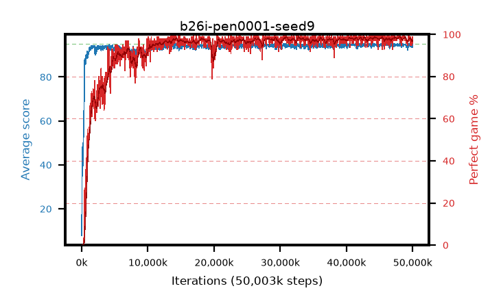

# b26i-pen0001-seed9

step **50,003,968** · 1526 evals · trailing **94.21** · peak **94.7** @46,170,112 · sef **92.3** · best30 **98.6** @48,005,120

## Config

| | |
|---|---|
| algo | ppo |
| collect_envs | 128 |
| discount | 0.99 |
| eval_interval | 32768 |
| eval_queue | True |
| eval_queue_depth | 16 |
| eval_workers | 8 |
| fc_layers | (320,) |
| graph_eval_episodes | 100 |
| max_steps | 50003968 |
| min_checkpoint_score | 40.0 |
| ppo_adam_epsilon | 1e-07 |
| ppo_anneal_fraction | 0.5 |
| ppo_clip | 0.2 |
| ppo_clip_final | None |
| ppo_discount_final | 0.999 |
| ppo_entropy_coef | 0.01 |
| ppo_entropy_coef_final | 0.001 |
| ppo_epochs | 4 |
| ppo_gae_lambda | 0.95 |
| ppo_gae_lambda_final | 0.999 |
| ppo_gradient_clipping | 0.5 |
| ppo_horizon | 16.8 |
| ppo_horizon_final | 500.3 |
| ppo_learning_rate | 0.00025 |
| ppo_learning_rate_final | None |
| ppo_minibatch | 512 |
| ppo_normalize_adv | True |
| ppo_rollout | 256 |
| ppo_target_kl | 0.0 |
| ppo_transitions_per_rollout | 32768 |
| ppo_value_loss | huber |
| ppo_vf_coef | 0.5 |
| seed | 9 |
| torch_threads | 1 |

## Evals

| step | avg score | trailing avg | min score | max score | avg reward | perfect % | epsilon |
|---|---|---|---|---|---|---|---|
| 32768 | 7.86 | 7.86 | 0.0 | 25.0 | 7.207 | 0.0 |  |
| 65536 | 39.99 | 34.75 | 2.0 | 78.0 | 37.604 | 0.0 |  |
| 98304 | 48.09 | 36.97 | 3.0 | 81.0 | 44.377 | 0.0 |  |
| ... | ... | ... | ... | ... | ... | ... | ... |
| 49643520 | 93.82 | 94.31 | 44.0 | 95.0 | 187.515 | 95.0 |  |
| 49676288 | 94.92 | 94.36 | 87.0 | 95.0 | 192.636 | 99.0 |  |
| 49709056 | 93.69 | 94.26 | 58.0 | 95.0 | 188.424 | 96.0 |  |
| 49741824 | 94.44 | 94.25 | 55.0 | 95.0 | 191.173 | 98.0 |  |
| 49774592 | 94.09 | 94.2 | 55.0 | 95.0 | 187.83 | 95.0 |  |
| 49807360 | 94.2 | 94.19 | 46.0 | 95.0 | 190.892 | 98.0 |  |
| 49840128 | 93.59 | 94.15 | 58.0 | 95.0 | 187.278 | 95.0 |  |
| 49872896 | 94.69 | 94.15 | 82.0 | 95.0 | 190.411 | 97.0 |  |
| 49905664 | 93.45 | 94.15 | 6.0 | 95.0 | 189.188 | 97.0 |  |
| 49938432 | 94.33 | 94.3 | 56.0 | 95.0 | 191.015 | 98.0 |  |
| 49971200 | 94.71 | 94.25 | 66.0 | 95.0 | 192.435 | 99.0 |  |
| 50003968 | 93.5 | 94.21 | 26.0 | 95.0 | 188.241 | 96.0 |  |
