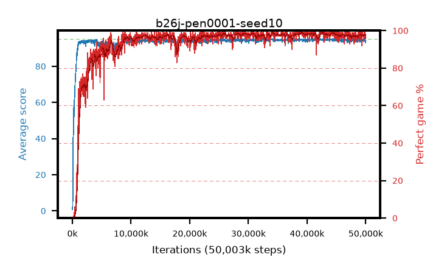

# b26j-pen0001-seed10

step **50,003,968** · 1526 evals · trailing **94.35** · peak **94.7** @43,024,384 · sef **94.1** · best30 **98.7** @39,157,760

## Config

| | |
|---|---|
| algo | ppo |
| collect_envs | 128 |
| discount | 0.99 |
| eval_interval | 32768 |
| eval_queue | True |
| eval_queue_depth | 16 |
| eval_workers | 8 |
| fc_layers | (320,) |
| graph_eval_episodes | 100 |
| max_steps | 50003968 |
| min_checkpoint_score | 40.0 |
| ppo_adam_epsilon | 1e-07 |
| ppo_anneal_fraction | 0.5 |
| ppo_clip | 0.2 |
| ppo_clip_final | None |
| ppo_discount_final | 0.999 |
| ppo_entropy_coef | 0.01 |
| ppo_entropy_coef_final | 0.001 |
| ppo_epochs | 4 |
| ppo_gae_lambda | 0.95 |
| ppo_gae_lambda_final | 0.999 |
| ppo_gradient_clipping | 0.5 |
| ppo_horizon | 16.8 |
| ppo_horizon_final | 500.3 |
| ppo_learning_rate | 0.00025 |
| ppo_learning_rate_final | None |
| ppo_minibatch | 512 |
| ppo_normalize_adv | True |
| ppo_rollout | 256 |
| ppo_target_kl | 0.0 |
| ppo_transitions_per_rollout | 32768 |
| ppo_value_loss | huber |
| ppo_vf_coef | 0.5 |
| seed | 10 |
| torch_threads | 1 |

## Evals

| step | avg score | trailing avg | min score | max score | avg reward | perfect % | epsilon |
|---|---|---|---|---|---|---|---|
| 32768 | 0.73 | 0.73 | 0.0 | 6.0 | 0.175 | 0.0 |  |
| 65536 | 6.16 | 3.45 | 1.0 | 28.0 | 5.548 | 0.0 |  |
| 98304 | 40.45 | 15.78 | 1.0 | 72.0 | 35.9 | 0.0 |  |
| ... | ... | ... | ... | ... | ... | ... | ... |
| 49643520 | 94.56 | 94.44 | 72.0 | 95.0 | 191.29 | 98.0 |  |
| 49676288 | 93.92 | 94.43 | 58.0 | 95.0 | 188.655 | 96.0 |  |
| 49709056 | 93.62 | 94.41 | 56.0 | 95.0 | 187.364 | 95.0 |  |
| 49741824 | 94.67 | 94.44 | 62.0 | 95.0 | 192.404 | 99.0 |  |
| 49774592 | 94.27 | 94.41 | 67.0 | 95.0 | 189.006 | 96.0 |  |
| 49807360 | 95.0 | 94.45 | 95.0 | 95.0 | 193.728 | 100.0 |  |
| 49840128 | 94.92 | 94.44 | 87.0 | 95.0 | 192.652 | 99.0 |  |
| 49872896 | 94.86 | 94.44 | 81.0 | 95.0 | 192.592 | 99.0 |  |
| 49905664 | 94.85 | 94.45 | 80.0 | 95.0 | 192.576 | 99.0 |  |
| 49938432 | 94.2 | 94.46 | 66.0 | 95.0 | 189.938 | 97.0 |  |
| 49971200 | 94.29 | 94.43 | 58.0 | 95.0 | 191.019 | 98.0 |  |
| 50003968 | 93.15 | 94.35 | 12.0 | 95.0 | 187.894 | 96.0 |  |
