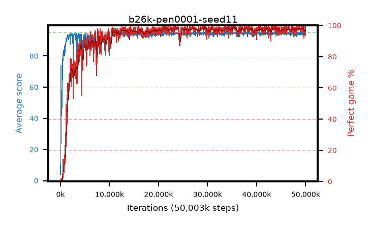

# b26k-pen0001-seed11

step **50,003,968** · 1526 evals · trailing **94.46** · peak **94.63** @35,651,584 · sef **92.3** · best30 **98.3** @35,782,656

## Config

| | |
|---|---|
| algo | ppo |
| collect_envs | 128 |
| discount | 0.99 |
| eval_interval | 32768 |
| eval_queue | True |
| eval_queue_depth | 16 |
| eval_workers | 8 |
| fc_layers | (320,) |
| graph_eval_episodes | 100 |
| max_steps | 50003968 |
| min_checkpoint_score | 40.0 |
| ppo_adam_epsilon | 1e-07 |
| ppo_anneal_fraction | 0.5 |
| ppo_clip | 0.2 |
| ppo_clip_final | None |
| ppo_discount_final | 0.999 |
| ppo_entropy_coef | 0.01 |
| ppo_entropy_coef_final | 0.001 |
| ppo_epochs | 4 |
| ppo_gae_lambda | 0.95 |
| ppo_gae_lambda_final | 0.999 |
| ppo_gradient_clipping | 0.5 |
| ppo_horizon | 16.8 |
| ppo_horizon_final | 500.3 |
| ppo_learning_rate | 0.00025 |
| ppo_learning_rate_final | None |
| ppo_minibatch | 512 |
| ppo_normalize_adv | True |
| ppo_rollout | 256 |
| ppo_target_kl | 0.0 |
| ppo_transitions_per_rollout | 32768 |
| ppo_value_loss | huber |
| ppo_vf_coef | 0.5 |
| seed | 11 |
| torch_threads | 1 |

## Evals

| step | avg score | trailing avg | min score | max score | avg reward | perfect % | epsilon |
|---|---|---|---|---|---|---|---|
| 32768 | 4.05 | 4.05 | 0.0 | 12.0 | 1.456 | 0.0 |  |
| 65536 | 27.38 | 15.71 | 1.0 | 95.0 | 28.245 | 2.0 |  |
| 98304 | 73.99 | 42.12 | 13.0 | 95.0 | 73.931 | 2.0 |  |
| ... | ... | ... | ... | ... | ... | ... | ... |
| 49643520 | 94.54 | 94.44 | 70.0 | 95.0 | 190.268 | 97.0 |  |
| 49676288 | 93.45 | 94.46 | 16.0 | 95.0 | 184.199 | 92.0 |  |
| 49709056 | 94.46 | 94.47 | 63.0 | 95.0 | 190.194 | 97.0 |  |
| 49741824 | 94.22 | 94.47 | 58.0 | 95.0 | 189.955 | 97.0 |  |
| 49774592 | 94.44 | 94.48 | 80.0 | 95.0 | 187.131 | 94.0 |  |
| 49807360 | 94.61 | 94.42 | 78.0 | 95.0 | 190.337 | 97.0 |  |
| 49840128 | 94.69 | 94.42 | 78.0 | 95.0 | 191.411 | 98.0 |  |
| 49872896 | 94.54 | 94.45 | 78.0 | 95.0 | 189.254 | 96.0 |  |
| 49905664 | 95.0 | 94.47 | 95.0 | 95.0 | 193.711 | 100.0 |  |
| 49938432 | 95.0 | 94.48 | 95.0 | 95.0 | 193.722 | 100.0 |  |
| 49971200 | 93.26 | 94.46 | 14.0 | 95.0 | 187.995 | 96.0 |  |
| 50003968 | 94.75 | 94.46 | 82.0 | 95.0 | 191.474 | 98.0 |  |
