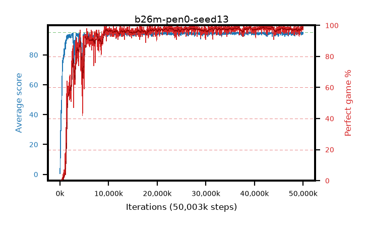

# b26m-pen0-seed13

step **50,003,968** · 1526 evals · trailing **94.47** · peak **94.6** @36,601,856 · sef **92.5** · best30 **98.5** @42,434,560

## Config

| | |
|---|---|
| algo | ppo |
| collect_envs | 128 |
| discount | 0.99 |
| eval_interval | 32768 |
| eval_queue | True |
| eval_queue_depth | 16 |
| eval_workers | 8 |
| fc_layers | (320,) |
| graph_eval_episodes | 100 |
| max_steps | 50003968 |
| min_checkpoint_score | 40.0 |
| ppo_adam_epsilon | 1e-07 |
| ppo_anneal_fraction | 0.5 |
| ppo_clip | 0.2 |
| ppo_clip_final | None |
| ppo_discount_final | 0.999 |
| ppo_entropy_coef | 0.01 |
| ppo_entropy_coef_final | 0.001 |
| ppo_epochs | 4 |
| ppo_gae_lambda | 0.95 |
| ppo_gae_lambda_final | 0.999 |
| ppo_gradient_clipping | 0.5 |
| ppo_horizon | 16.8 |
| ppo_horizon_final | 500.3 |
| ppo_learning_rate | 0.00025 |
| ppo_learning_rate_final | None |
| ppo_minibatch | 512 |
| ppo_normalize_adv | True |
| ppo_rollout | 256 |
| ppo_target_kl | 0.0 |
| ppo_transitions_per_rollout | 32768 |
| ppo_value_loss | huber |
| ppo_vf_coef | 0.5 |
| seed | 13 |
| torch_threads | 1 |

## Evals

| step | avg score | trailing avg | min score | max score | avg reward | perfect % | epsilon |
|---|---|---|---|---|---|---|---|
| 32768 | 0.51 | 0.51 | 0.0 | 4.0 | -3.385 | 0.0 |  |
| 65536 | 11.54 | 6.02 | 1.0 | 35.0 | 7.767 | 0.0 |  |
| 98304 | 25.41 | 12.49 | 9.0 | 45.0 | 20.363 | 0.0 |  |
| ... | ... | ... | ... | ... | ... | ... | ... |
| 49643520 | 93.32 | 94.41 | 22.0 | 95.0 | 188.054 | 96.0 |  |
| 49676288 | 94.7 | 94.46 | 70.0 | 95.0 | 191.42 | 98.0 |  |
| 49709056 | 94.77 | 94.43 | 72.0 | 95.0 | 192.496 | 99.0 |  |
| 49741824 | 94.95 | 94.46 | 90.0 | 95.0 | 192.672 | 99.0 |  |
| 49774592 | 95.0 | 94.49 | 95.0 | 95.0 | 193.714 | 100.0 |  |
| 49807360 | 94.42 | 94.46 | 61.0 | 95.0 | 191.139 | 98.0 |  |
| 49840128 | 94.53 | 94.5 | 69.0 | 95.0 | 191.2 | 98.0 |  |
| 49872896 | 93.6 | 94.46 | 12.0 | 95.0 | 189.287 | 97.0 |  |
| 49905664 | 94.69 | 94.46 | 64.0 | 95.0 | 192.403 | 99.0 |  |
| 49938432 | 93.93 | 94.44 | 18.0 | 95.0 | 189.656 | 97.0 |  |
| 49971200 | 95.0 | 94.49 | 95.0 | 95.0 | 193.708 | 100.0 |  |
| 50003968 | 95.0 | 94.47 | 95.0 | 95.0 | 193.717 | 100.0 |  |
