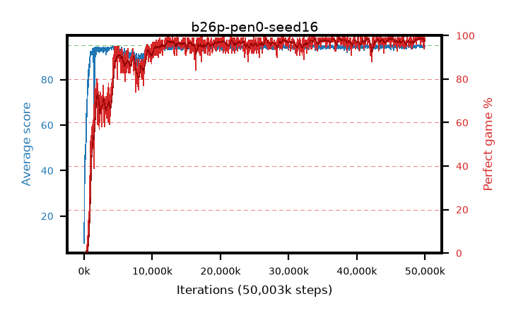

# b26p-pen0-seed16

step **50,003,968** · 1526 evals · trailing **94.59** · peak **94.66** @49,184,768 · sef **91.0** · best30 **98.7** @49,741,824

## Config

| | |
|---|---|
| algo | ppo |
| collect_envs | 128 |
| discount | 0.99 |
| eval_interval | 32768 |
| eval_queue | True |
| eval_queue_depth | 16 |
| eval_workers | 8 |
| fc_layers | (320,) |
| graph_eval_episodes | 100 |
| max_steps | 50003968 |
| min_checkpoint_score | 40.0 |
| ppo_adam_epsilon | 1e-07 |
| ppo_anneal_fraction | 0.5 |
| ppo_clip | 0.2 |
| ppo_clip_final | None |
| ppo_discount_final | 0.999 |
| ppo_entropy_coef | 0.01 |
| ppo_entropy_coef_final | 0.001 |
| ppo_epochs | 4 |
| ppo_gae_lambda | 0.95 |
| ppo_gae_lambda_final | 0.999 |
| ppo_gradient_clipping | 0.5 |
| ppo_horizon | 16.8 |
| ppo_horizon_final | 500.3 |
| ppo_learning_rate | 0.00025 |
| ppo_learning_rate_final | None |
| ppo_minibatch | 512 |
| ppo_normalize_adv | True |
| ppo_rollout | 256 |
| ppo_target_kl | 0.0 |
| ppo_transitions_per_rollout | 32768 |
| ppo_value_loss | huber |
| ppo_vf_coef | 0.5 |
| seed | 16 |
| torch_threads | 1 |

## Evals

| step | avg score | trailing avg | min score | max score | avg reward | perfect % | epsilon |
|---|---|---|---|---|---|---|---|
| 32768 | 8.07 | 8.07 | 0.0 | 30.0 | 5.798 | 0.0 |  |
| 65536 | 39.34 | 23.71 | 2.0 | 63.0 | 34.513 | 0.0 |  |
| 98304 | 46.75 | 31.39 | 20.0 | 65.0 | 41.68 | 0.0 |  |
| ... | ... | ... | ... | ... | ... | ... | ... |
| 49643520 | 94.97 | 94.6 | 92.0 | 95.0 | 192.687 | 99.0 |  |
| 49676288 | 94.43 | 94.63 | 66.0 | 95.0 | 191.156 | 98.0 |  |
| 49709056 | 94.08 | 94.6 | 29.0 | 95.0 | 190.762 | 98.0 |  |
| 49741824 | 95.0 | 94.64 | 95.0 | 95.0 | 193.726 | 100.0 |  |
| 49774592 | 94.49 | 94.66 | 75.0 | 95.0 | 188.218 | 95.0 |  |
| 49807360 | 94.8 | 94.64 | 82.0 | 95.0 | 191.52 | 98.0 |  |
| 49840128 | 94.58 | 94.66 | 81.0 | 95.0 | 189.308 | 96.0 |  |
| 49872896 | 93.89 | 94.64 | 56.0 | 95.0 | 186.624 | 94.0 |  |
| 49905664 | 94.87 | 94.64 | 82.0 | 95.0 | 192.589 | 99.0 |  |
| 49938432 | 94.9 | 94.64 | 85.0 | 95.0 | 192.616 | 99.0 |  |
| 49971200 | 94.62 | 94.61 | 75.0 | 95.0 | 191.349 | 98.0 |  |
| 50003968 | 94.47 | 94.59 | 65.0 | 95.0 | 191.197 | 98.0 |  |
