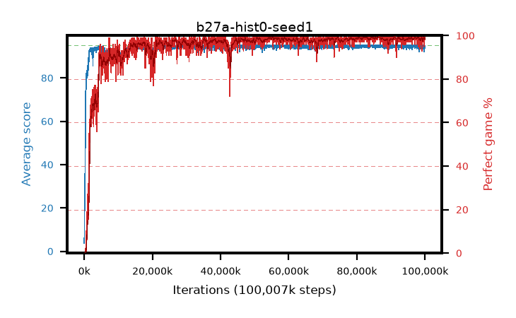

# b27a-hist0-seed1

step **100,007,936** · 3052 evals · trailing **94.43** · peak **94.84** @91,357,184 · sef **95.6** · best30 **99.4** @86,802,432

## Config

| | |
|---|---|
| algo | ppo |
| collect_envs | 128 |
| discount | 0.99 |
| eval_interval | 32768 |
| eval_queue | True |
| eval_queue_depth | 16 |
| eval_workers | 8 |
| fc_layers | (320,) |
| graph_eval_episodes | 100 |
| max_steps | 100007936 |
| min_checkpoint_score | 40.0 |
| ppo_adam_epsilon | 1e-07 |
| ppo_anneal_fraction | 0.5 |
| ppo_clip | 0.2 |
| ppo_clip_final | None |
| ppo_discount_final | 0.999 |
| ppo_entropy_coef | 0.01 |
| ppo_entropy_coef_final | 0.001 |
| ppo_epochs | 4 |
| ppo_gae_lambda | 0.95 |
| ppo_gae_lambda_final | 0.999 |
| ppo_gradient_clipping | 0.5 |
| ppo_horizon | 16.8 |
| ppo_horizon_final | 500.3 |
| ppo_learning_rate | 0.00025 |
| ppo_learning_rate_final | None |
| ppo_minibatch | 512 |
| ppo_normalize_adv | True |
| ppo_rollout | 256 |
| ppo_target_kl | 0.0 |
| ppo_transitions_per_rollout | 32768 |
| ppo_value_loss | huber |
| ppo_vf_coef | 0.5 |
| seed | 1 |
| torch_threads | 1 |

## Evals

| step | avg score | trailing avg | min score | max score | avg reward | perfect % | epsilon |
|---|---|---|---|---|---|---|---|
| 32768 | 3.73 | 3.73 | 0.0 | 8.0 | -0.861 | 0.0 |  |
| 65536 | 8.05 | 5.89 | 0.0 | 26.0 | 7.194 | 0.0 |  |
| 98304 | 23.85 | 18.65 | 0.0 | 47.0 | 19.871 | 0.0 |  |
| ... | ... | ... | ... | ... | ... | ... | ... |
| 99647488 | 92.17 | 94.41 | 12.0 | 95.0 | 185.924 | 95.0 |  |
| 99680256 | 94.68 | 94.4 | 76.0 | 95.0 | 191.4 | 98.0 |  |
| 99713024 | 94.37 | 94.45 | 32.0 | 95.0 | 192.063 | 99.0 |  |
| 99745792 | 94.15 | 94.41 | 10.0 | 95.0 | 191.89 | 99.0 |  |
| 99778560 | 94.95 | 94.47 | 90.0 | 95.0 | 192.676 | 99.0 |  |
| 99811328 | 95.0 | 94.48 | 95.0 | 95.0 | 193.732 | 100.0 |  |
| 99844096 | 94.61 | 94.48 | 56.0 | 95.0 | 192.338 | 99.0 |  |
| 99876864 | 94.59 | 94.47 | 61.0 | 95.0 | 191.327 | 98.0 |  |
| 99909632 | 94.97 | 94.48 | 92.0 | 95.0 | 192.697 | 99.0 |  |
| 99942400 | 94.68 | 94.46 | 63.0 | 95.0 | 192.372 | 99.0 |  |
| 99975168 | 93.8 | 94.43 | 9.0 | 95.0 | 190.499 | 98.0 |  |
| 100007936 | 94.19 | 94.43 | 14.0 | 95.0 | 191.923 | 99.0 |  |
