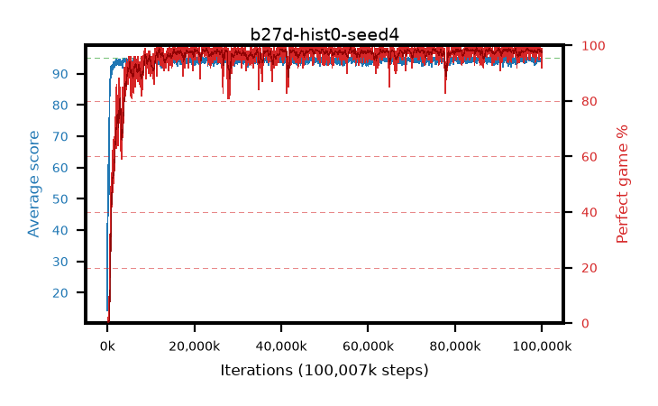

# b27d-hist0-seed4

step **100,007,936** · 3052 evals · trailing **94.55** · peak **94.71** @97,091,584 · sef **96.7** · best30 **98.6** @75,595,776

## Config

| | |
|---|---|
| algo | ppo |
| collect_envs | 128 |
| discount | 0.99 |
| eval_interval | 32768 |
| eval_queue | True |
| eval_queue_depth | 16 |
| eval_workers | 8 |
| fc_layers | (320,) |
| graph_eval_episodes | 100 |
| max_steps | 100007936 |
| min_checkpoint_score | 40.0 |
| ppo_adam_epsilon | 1e-07 |
| ppo_anneal_fraction | 0.5 |
| ppo_clip | 0.2 |
| ppo_clip_final | None |
| ppo_discount_final | 0.999 |
| ppo_entropy_coef | 0.01 |
| ppo_entropy_coef_final | 0.001 |
| ppo_epochs | 4 |
| ppo_gae_lambda | 0.95 |
| ppo_gae_lambda_final | 0.999 |
| ppo_gradient_clipping | 0.5 |
| ppo_horizon | 16.8 |
| ppo_horizon_final | 500.3 |
| ppo_learning_rate | 0.00025 |
| ppo_learning_rate_final | None |
| ppo_minibatch | 512 |
| ppo_normalize_adv | True |
| ppo_rollout | 256 |
| ppo_target_kl | 0.0 |
| ppo_transitions_per_rollout | 32768 |
| ppo_value_loss | huber |
| ppo_vf_coef | 0.5 |
| seed | 4 |
| torch_threads | 1 |

## Evals

| step | avg score | trailing avg | min score | max score | avg reward | perfect % | epsilon |
|---|---|---|---|---|---|---|---|
| 32768 | 14.31 | 14.31 | 0.0 | 33.0 | 10.634 | 0.0 |  |
| 65536 | 60.91 | 43.57 | 0.0 | 91.0 | 58.176 | 0.0 |  |
| 98304 | 54.26 | 45.35 | 0.0 | 84.0 | 50.041 | 0.0 |  |
| ... | ... | ... | ... | ... | ... | ... | ... |
| 99647488 | 94.95 | 94.53 | 90.0 | 95.0 | 192.676 | 99.0 |  |
| 99680256 | 94.34 | 94.54 | 62.0 | 95.0 | 189.075 | 96.0 |  |
| 99713024 | 94.75 | 94.54 | 70.0 | 95.0 | 192.49 | 99.0 |  |
| 99745792 | 94.44 | 94.51 | 62.0 | 95.0 | 191.181 | 98.0 |  |
| 99778560 | 94.31 | 94.52 | 26.0 | 95.0 | 192.047 | 99.0 |  |
| 99811328 | 94.77 | 94.52 | 74.0 | 95.0 | 191.493 | 98.0 |  |
| 99844096 | 94.12 | 94.53 | 59.0 | 95.0 | 188.86 | 96.0 |  |
| 99876864 | 94.24 | 94.55 | 31.0 | 95.0 | 190.92 | 98.0 |  |
| 99909632 | 94.78 | 94.56 | 73.0 | 95.0 | 192.507 | 99.0 |  |
| 99942400 | 94.66 | 94.56 | 77.0 | 95.0 | 191.396 | 98.0 |  |
| 99975168 | 93.68 | 94.51 | 66.0 | 95.0 | 184.367 | 92.0 |  |
| 100007936 | 94.62 | 94.55 | 82.0 | 95.0 | 189.346 | 96.0 |  |
