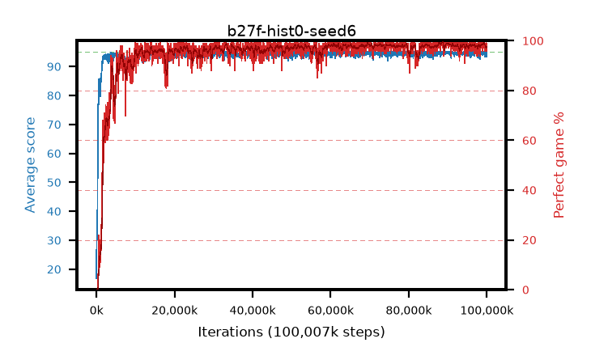

# b27f-hist0-seed6

step **100,007,936** · 3052 evals · trailing **94.48** · peak **94.76** @90,308,608 · sef **95.8** · best30 **99.2** @88,702,976

## Config

| | |
|---|---|
| algo | ppo |
| collect_envs | 128 |
| discount | 0.99 |
| eval_interval | 32768 |
| eval_queue | True |
| eval_queue_depth | 16 |
| eval_workers | 8 |
| fc_layers | (320,) |
| graph_eval_episodes | 100 |
| max_steps | 100007936 |
| min_checkpoint_score | 40.0 |
| ppo_adam_epsilon | 1e-07 |
| ppo_anneal_fraction | 0.5 |
| ppo_clip | 0.2 |
| ppo_clip_final | None |
| ppo_discount_final | 0.999 |
| ppo_entropy_coef | 0.01 |
| ppo_entropy_coef_final | 0.001 |
| ppo_epochs | 4 |
| ppo_gae_lambda | 0.95 |
| ppo_gae_lambda_final | 0.999 |
| ppo_gradient_clipping | 0.5 |
| ppo_horizon | 16.8 |
| ppo_horizon_final | 500.3 |
| ppo_learning_rate | 0.00025 |
| ppo_learning_rate_final | None |
| ppo_minibatch | 512 |
| ppo_normalize_adv | True |
| ppo_rollout | 256 |
| ppo_target_kl | 0.0 |
| ppo_transitions_per_rollout | 32768 |
| ppo_value_loss | huber |
| ppo_vf_coef | 0.5 |
| seed | 6 |
| torch_threads | 1 |

## Evals

| step | avg score | trailing avg | min score | max score | avg reward | perfect % | epsilon |
|---|---|---|---|---|---|---|---|
| 32768 | 16.84 | 16.84 | 2.0 | 31.0 | 11.898 | 0.0 |  |
| 65536 | 33.6 | 25.22 | 9.0 | 56.0 | 28.525 | 0.0 |  |
| 98304 | 31.7 | 27.38 | 11.0 | 62.0 | 26.685 | 0.0 |  |
| ... | ... | ... | ... | ... | ... | ... | ... |
| 99647488 | 94.56 | 94.61 | 71.0 | 95.0 | 190.296 | 97.0 |  |
| 99680256 | 93.31 | 94.57 | 17.0 | 95.0 | 188.014 | 96.0 |  |
| 99713024 | 94.08 | 94.53 | 58.0 | 95.0 | 188.818 | 96.0 |  |
| 99745792 | 94.46 | 94.52 | 68.0 | 95.0 | 190.202 | 97.0 |  |
| 99778560 | 94.73 | 94.55 | 68.0 | 95.0 | 192.458 | 99.0 |  |
| 99811328 | 94.69 | 94.55 | 64.0 | 95.0 | 192.424 | 99.0 |  |
| 99844096 | 94.29 | 94.5 | 69.0 | 95.0 | 189.028 | 96.0 |  |
| 99876864 | 94.95 | 94.52 | 90.0 | 95.0 | 192.676 | 99.0 |  |
| 99909632 | 93.26 | 94.48 | 8.0 | 95.0 | 187.96 | 96.0 |  |
| 99942400 | 94.28 | 94.48 | 58.0 | 95.0 | 191.011 | 98.0 |  |
| 99975168 | 94.68 | 94.5 | 63.0 | 95.0 | 192.411 | 99.0 |  |
| 100007936 | 94.8 | 94.48 | 85.0 | 95.0 | 191.533 | 98.0 |  |
