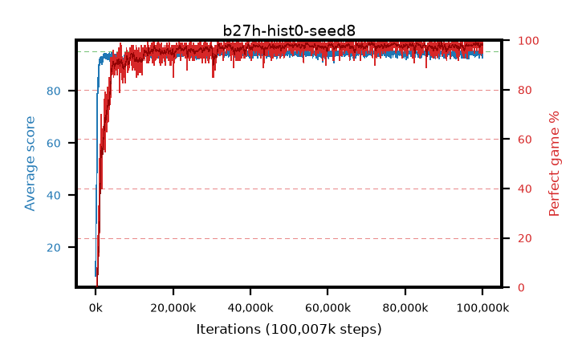

# b27h-hist0-seed8

step **100,007,936** · 3052 evals · trailing **94.25** · peak **94.64** @77,201,408 · sef **96.4** · best30 **98.7** @77,463,552

## Config

| | |
|---|---|
| algo | ppo |
| collect_envs | 128 |
| discount | 0.99 |
| eval_interval | 32768 |
| eval_queue | True |
| eval_queue_depth | 16 |
| eval_workers | 8 |
| fc_layers | (320,) |
| graph_eval_episodes | 100 |
| max_steps | 100007936 |
| min_checkpoint_score | 40.0 |
| ppo_adam_epsilon | 1e-07 |
| ppo_anneal_fraction | 0.5 |
| ppo_clip | 0.2 |
| ppo_clip_final | None |
| ppo_discount_final | 0.999 |
| ppo_entropy_coef | 0.01 |
| ppo_entropy_coef_final | 0.001 |
| ppo_epochs | 4 |
| ppo_gae_lambda | 0.95 |
| ppo_gae_lambda_final | 0.999 |
| ppo_gradient_clipping | 0.5 |
| ppo_horizon | 16.8 |
| ppo_horizon_final | 500.3 |
| ppo_learning_rate | 0.00025 |
| ppo_learning_rate_final | None |
| ppo_minibatch | 512 |
| ppo_normalize_adv | True |
| ppo_rollout | 256 |
| ppo_target_kl | 0.0 |
| ppo_transitions_per_rollout | 32768 |
| ppo_value_loss | huber |
| ppo_vf_coef | 0.5 |
| seed | 8 |
| torch_threads | 1 |

## Evals

| step | avg score | trailing avg | min score | max score | avg reward | perfect % | epsilon |
|---|---|---|---|---|---|---|---|
| 32768 | 9.0 | 9.0 | 0.0 | 31.0 | 7.093 | 0.0 |  |
| 65536 | 18.31 | 23.84 | 1.0 | 70.0 | 16.731 | 0.0 |  |
| 98304 | 35.77 | 22.39 | 11.0 | 72.0 | 30.741 | 0.0 |  |
| ... | ... | ... | ... | ... | ... | ... | ... |
| 99647488 | 95.0 | 94.41 | 95.0 | 95.0 | 193.73 | 100.0 |  |
| 99680256 | 93.97 | 94.39 | 20.0 | 95.0 | 190.705 | 98.0 |  |
| 99713024 | 95.0 | 94.39 | 95.0 | 95.0 | 193.727 | 100.0 |  |
| 99745792 | 94.95 | 94.38 | 90.0 | 95.0 | 192.685 | 99.0 |  |
| 99778560 | 94.9 | 94.37 | 85.0 | 95.0 | 192.631 | 99.0 |  |
| 99811328 | 94.63 | 94.38 | 58.0 | 95.0 | 192.363 | 99.0 |  |
| 99844096 | 92.66 | 94.33 | 6.0 | 95.0 | 187.363 | 96.0 |  |
| 99876864 | 95.0 | 94.4 | 95.0 | 95.0 | 193.736 | 100.0 |  |
| 99909632 | 93.87 | 94.33 | 18.0 | 95.0 | 189.611 | 97.0 |  |
| 99942400 | 93.81 | 94.3 | 6.0 | 95.0 | 190.554 | 98.0 |  |
| 99975168 | 94.33 | 94.28 | 62.0 | 95.0 | 190.062 | 97.0 |  |
| 100007936 | 92.68 | 94.25 | 9.0 | 95.0 | 186.429 | 95.0 |  |
