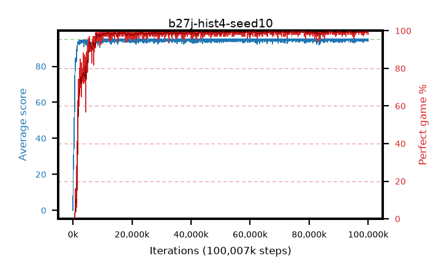

# b27j-hist4-seed10

step **100,007,936** · 3052 evals · trailing **94.75** · peak **94.87** @86,966,272 · sef **96.1** · best30 **99.7** @78,413,824

## Config

| | |
|---|---|
| algo | ppo |
| collect_envs | 128 |
| discount | 0.99 |
| eval_interval | 32768 |
| eval_queue | True |
| eval_queue_depth | 16 |
| eval_workers | 8 |
| fc_layers | (320,) |
| graph_eval_episodes | 100 |
| max_steps | 100007936 |
| min_checkpoint_score | 40.0 |
| ppo_adam_epsilon | 1e-07 |
| ppo_anneal_fraction | 0.5 |
| ppo_clip | 0.2 |
| ppo_clip_final | None |
| ppo_discount_final | 0.999 |
| ppo_entropy_coef | 0.01 |
| ppo_entropy_coef_final | 0.001 |
| ppo_epochs | 4 |
| ppo_gae_lambda | 0.95 |
| ppo_gae_lambda_final | 0.999 |
| ppo_gradient_clipping | 0.5 |
| ppo_horizon | 16.8 |
| ppo_horizon_final | 500.3 |
| ppo_learning_rate | 0.00025 |
| ppo_learning_rate_final | None |
| ppo_minibatch | 512 |
| ppo_normalize_adv | True |
| ppo_rollout | 256 |
| ppo_target_kl | 0.0 |
| ppo_transitions_per_rollout | 32768 |
| ppo_value_loss | huber |
| ppo_vf_coef | 0.5 |
| seed | 10 |
| torch_threads | 1 |

## Evals

| step | avg score | trailing avg | min score | max score | avg reward | perfect % | epsilon |
|---|---|---|---|---|---|---|---|
| 32768 | 0.04 | 0.04 | 0.0 | 1.0 | -0.51 | 0.0 |  |
| 65536 | 11.38 | 5.71 | 0.0 | 44.0 | 9.099 | 0.0 |  |
| 98304 | 27.08 | 12.83 | 1.0 | 49.0 | 22.296 | 0.0 |  |
| ... | ... | ... | ... | ... | ... | ... | ... |
| 99647488 | 95.0 | 94.74 | 95.0 | 95.0 | 193.758 | 100.0 |  |
| 99680256 | 95.0 | 94.75 | 95.0 | 95.0 | 193.756 | 100.0 |  |
| 99713024 | 95.0 | 94.74 | 95.0 | 95.0 | 193.762 | 100.0 |  |
| 99745792 | 95.0 | 94.74 | 95.0 | 95.0 | 193.76 | 100.0 |  |
| 99778560 | 95.0 | 94.76 | 95.0 | 95.0 | 193.762 | 100.0 |  |
| 99811328 | 95.0 | 94.79 | 95.0 | 95.0 | 193.771 | 100.0 |  |
| 99844096 | 95.0 | 94.75 | 95.0 | 95.0 | 193.762 | 100.0 |  |
| 99876864 | 95.0 | 94.79 | 95.0 | 95.0 | 193.755 | 100.0 |  |
| 99909632 | 95.0 | 94.78 | 95.0 | 95.0 | 193.765 | 100.0 |  |
| 99942400 | 94.35 | 94.77 | 30.0 | 95.0 | 192.115 | 99.0 |  |
| 99975168 | 95.0 | 94.8 | 95.0 | 95.0 | 193.764 | 100.0 |  |
| 100007936 | 94.14 | 94.75 | 50.0 | 95.0 | 190.906 | 98.0 |  |
