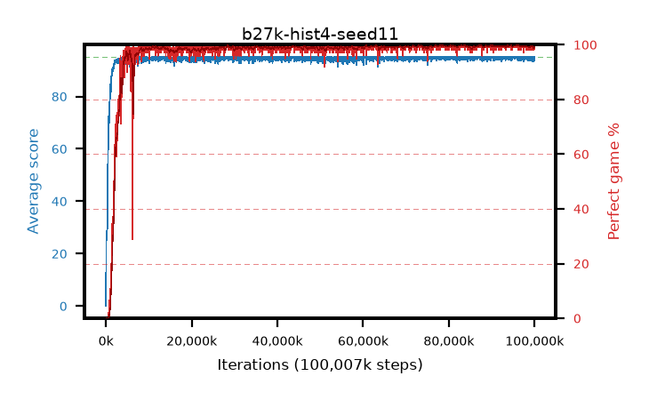

# b27k-hist4-seed11

step **100,007,936** · 3052 evals · trailing **94.56** · peak **94.91** @95,879,168 · sef **96.6** · best30 **99.8** @83,525,632

## Config

| | |
|---|---|
| algo | ppo |
| collect_envs | 128 |
| discount | 0.99 |
| eval_interval | 32768 |
| eval_queue | True |
| eval_queue_depth | 16 |
| eval_workers | 8 |
| fc_layers | (320,) |
| graph_eval_episodes | 100 |
| max_steps | 100007936 |
| min_checkpoint_score | 40.0 |
| ppo_adam_epsilon | 1e-07 |
| ppo_anneal_fraction | 0.5 |
| ppo_clip | 0.2 |
| ppo_clip_final | None |
| ppo_discount_final | 0.999 |
| ppo_entropy_coef | 0.01 |
| ppo_entropy_coef_final | 0.001 |
| ppo_epochs | 4 |
| ppo_gae_lambda | 0.95 |
| ppo_gae_lambda_final | 0.999 |
| ppo_gradient_clipping | 0.5 |
| ppo_horizon | 16.8 |
| ppo_horizon_final | 500.3 |
| ppo_learning_rate | 0.00025 |
| ppo_learning_rate_final | None |
| ppo_minibatch | 512 |
| ppo_normalize_adv | True |
| ppo_rollout | 256 |
| ppo_target_kl | 0.0 |
| ppo_transitions_per_rollout | 32768 |
| ppo_value_loss | huber |
| ppo_vf_coef | 0.5 |
| seed | 11 |
| torch_threads | 1 |

## Evals

| step | avg score | trailing avg | min score | max score | avg reward | perfect % | epsilon |
|---|---|---|---|---|---|---|---|
| 32768 | 0.08 | 0.08 | 0.0 | 1.0 | -0.47 | 0.0 |  |
| 65536 | 21.27 | 10.67 | 0.0 | 41.0 | 16.871 | 0.0 |  |
| 98304 | 26.71 | 19.08 | 9.0 | 55.0 | 21.752 | 0.0 |  |
| ... | ... | ... | ... | ... | ... | ... | ... |
| 99647488 | 94.68 | 94.57 | 63.0 | 95.0 | 192.401 | 99.0 |  |
| 99680256 | 95.0 | 94.57 | 95.0 | 95.0 | 193.766 | 100.0 |  |
| 99713024 | 94.26 | 94.57 | 57.0 | 95.0 | 191.03 | 98.0 |  |
| 99745792 | 95.0 | 94.59 | 95.0 | 95.0 | 193.761 | 100.0 |  |
| 99778560 | 93.81 | 94.56 | 12.0 | 95.0 | 190.498 | 98.0 |  |
| 99811328 | 95.0 | 94.56 | 95.0 | 95.0 | 193.77 | 100.0 |  |
| 99844096 | 93.32 | 94.54 | 6.0 | 95.0 | 190.092 | 98.0 |  |
| 99876864 | 94.58 | 94.58 | 53.0 | 95.0 | 192.303 | 99.0 |  |
| 99909632 | 95.0 | 94.56 | 95.0 | 95.0 | 193.765 | 100.0 |  |
| 99942400 | 94.64 | 94.54 | 59.0 | 95.0 | 192.361 | 99.0 |  |
| 99975168 | 94.63 | 94.53 | 58.0 | 95.0 | 192.363 | 99.0 |  |
| 100007936 | 95.0 | 94.56 | 95.0 | 95.0 | 193.767 | 100.0 |  |
