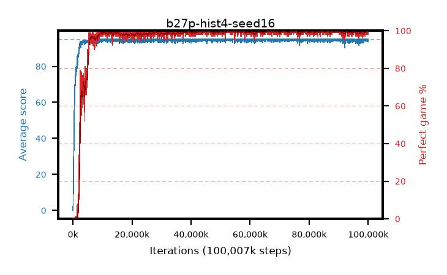

# b27p-hist4-seed16

step **100,007,936** · 3052 evals · trailing **94.73** · peak **94.89** @54,689,792 · sef **95.2** · best30 **99.8** @75,726,848

## Config

| | |
|---|---|
| algo | ppo |
| collect_envs | 128 |
| discount | 0.99 |
| eval_interval | 32768 |
| eval_queue | True |
| eval_queue_depth | 16 |
| eval_workers | 8 |
| fc_layers | (320,) |
| graph_eval_episodes | 100 |
| max_steps | 100007936 |
| min_checkpoint_score | 40.0 |
| ppo_adam_epsilon | 1e-07 |
| ppo_anneal_fraction | 0.5 |
| ppo_clip | 0.2 |
| ppo_clip_final | None |
| ppo_discount_final | 0.999 |
| ppo_entropy_coef | 0.01 |
| ppo_entropy_coef_final | 0.001 |
| ppo_epochs | 4 |
| ppo_gae_lambda | 0.95 |
| ppo_gae_lambda_final | 0.999 |
| ppo_gradient_clipping | 0.5 |
| ppo_horizon | 16.8 |
| ppo_horizon_final | 500.3 |
| ppo_learning_rate | 0.00025 |
| ppo_learning_rate_final | None |
| ppo_minibatch | 512 |
| ppo_normalize_adv | True |
| ppo_rollout | 256 |
| ppo_target_kl | 0.0 |
| ppo_transitions_per_rollout | 32768 |
| ppo_value_loss | huber |
| ppo_vf_coef | 0.5 |
| seed | 16 |
| torch_threads | 1 |

## Evals

| step | avg score | trailing avg | min score | max score | avg reward | perfect % | epsilon |
|---|---|---|---|---|---|---|---|
| 32768 | 0.07 | 0.07 | 0.0 | 2.0 | -0.569 | 0.0 |  |
| 65536 | 3.53 | 6.09 | 0.0 | 24.0 | 1.937 | 0.0 |  |
| 98304 | 14.68 | 7.38 | 2.0 | 34.0 | 10.238 | 0.0 |  |
| ... | ... | ... | ... | ... | ... | ... | ... |
| 99647488 | 94.54 | 94.68 | 49.0 | 95.0 | 192.251 | 99.0 |  |
| 99680256 | 95.0 | 94.68 | 95.0 | 95.0 | 193.758 | 100.0 |  |
| 99713024 | 95.0 | 94.71 | 95.0 | 95.0 | 193.75 | 100.0 |  |
| 99745792 | 95.0 | 94.72 | 95.0 | 95.0 | 193.746 | 100.0 |  |
| 99778560 | 95.0 | 94.74 | 95.0 | 95.0 | 193.753 | 100.0 |  |
| 99811328 | 93.71 | 94.7 | 10.0 | 95.0 | 190.44 | 98.0 |  |
| 99844096 | 95.0 | 94.74 | 95.0 | 95.0 | 193.765 | 100.0 |  |
| 99876864 | 95.0 | 94.73 | 95.0 | 95.0 | 193.766 | 100.0 |  |
| 99909632 | 93.74 | 94.69 | 6.0 | 95.0 | 190.511 | 98.0 |  |
| 99942400 | 95.0 | 94.72 | 95.0 | 95.0 | 193.754 | 100.0 |  |
| 99975168 | 94.97 | 94.72 | 92.0 | 95.0 | 192.688 | 99.0 |  |
| 100007936 | 95.0 | 94.73 | 95.0 | 95.0 | 193.762 | 100.0 |  |
