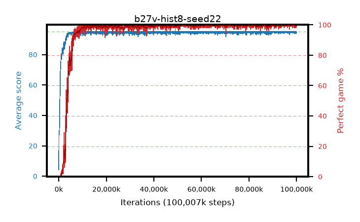

# b27v-hist8-seed22

step **100,007,936** · 3052 evals · trailing **94.7** · peak **94.91** @96,894,976 · sef **94.8** · best30 **99.8** @96,993,280

## Config

| | |
|---|---|
| algo | ppo |
| collect_envs | 128 |
| discount | 0.99 |
| eval_interval | 32768 |
| eval_queue | True |
| eval_queue_depth | 16 |
| eval_workers | 8 |
| fc_layers | (320,) |
| graph_eval_episodes | 100 |
| max_steps | 100007936 |
| min_checkpoint_score | 40.0 |
| ppo_adam_epsilon | 1e-07 |
| ppo_anneal_fraction | 0.5 |
| ppo_clip | 0.2 |
| ppo_clip_final | None |
| ppo_discount_final | 0.999 |
| ppo_entropy_coef | 0.01 |
| ppo_entropy_coef_final | 0.001 |
| ppo_epochs | 4 |
| ppo_gae_lambda | 0.95 |
| ppo_gae_lambda_final | 0.999 |
| ppo_gradient_clipping | 0.5 |
| ppo_horizon | 16.8 |
| ppo_horizon_final | 500.3 |
| ppo_learning_rate | 0.00025 |
| ppo_learning_rate_final | None |
| ppo_minibatch | 512 |
| ppo_normalize_adv | True |
| ppo_rollout | 256 |
| ppo_target_kl | 0.0 |
| ppo_transitions_per_rollout | 32768 |
| ppo_value_loss | huber |
| ppo_vf_coef | 0.5 |
| seed | 22 |
| torch_threads | 1 |

## Evals

| step | avg score | trailing avg | min score | max score | avg reward | perfect % | epsilon |
|---|---|---|---|---|---|---|---|
| 32768 | 4.24 | 4.24 | 0.0 | 11.0 | -0.113 | 0.0 |  |
| 65536 | 25.32 | 14.78 | 1.0 | 50.0 | 20.601 | 0.0 |  |
| 98304 | 29.65 | 19.74 | 1.0 | 51.0 | 24.641 | 0.0 |  |
| ... | ... | ... | ... | ... | ... | ... | ... |
| 99647488 | 94.99 | 94.84 | 94.0 | 95.0 | 192.729 | 99.0 |  |
| 99680256 | 94.54 | 94.8 | 49.0 | 95.0 | 192.308 | 99.0 |  |
| 99713024 | 94.32 | 94.82 | 27.0 | 95.0 | 192.055 | 99.0 |  |
| 99745792 | 95.0 | 94.8 | 95.0 | 95.0 | 193.773 | 100.0 |  |
| 99778560 | 95.0 | 94.77 | 95.0 | 95.0 | 193.777 | 100.0 |  |
| 99811328 | 95.0 | 94.77 | 95.0 | 95.0 | 193.772 | 100.0 |  |
| 99844096 | 93.85 | 94.73 | 21.0 | 95.0 | 190.591 | 98.0 |  |
| 99876864 | 95.0 | 94.76 | 95.0 | 95.0 | 193.773 | 100.0 |  |
| 99909632 | 94.41 | 94.73 | 36.0 | 95.0 | 192.187 | 99.0 |  |
| 99942400 | 94.09 | 94.75 | 4.0 | 95.0 | 191.828 | 99.0 |  |
| 99975168 | 94.23 | 94.68 | 18.0 | 95.0 | 192.01 | 99.0 |  |
| 100007936 | 94.31 | 94.7 | 26.0 | 95.0 | 192.039 | 99.0 |  |
