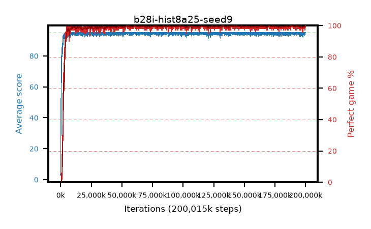

# b28i-hist8a25-seed9

step **200,015,872** · 6104 evals · trailing **94.66** · peak **94.96** @60,686,336 · sef **98.3** · best30 **99.9** @60,686,336

## Config

| | |
|---|---|
| algo | ppo |
| collect_envs | 128 |
| discount | 0.99 |
| eval_interval | 32768 |
| eval_queue | True |
| eval_queue_depth | 16 |
| eval_workers | 8 |
| fc_layers | (320,) |
| graph_eval_episodes | 100 |
| max_steps | 200015872 |
| min_checkpoint_score | 40.0 |
| ppo_adam_epsilon | 1e-07 |
| ppo_anneal_fraction | 0.25 |
| ppo_clip | 0.2 |
| ppo_clip_final | None |
| ppo_discount_final | 0.999 |
| ppo_entropy_coef | 0.01 |
| ppo_entropy_coef_final | 0.001 |
| ppo_epochs | 4 |
| ppo_gae_lambda | 0.95 |
| ppo_gae_lambda_final | 0.999 |
| ppo_gradient_clipping | 0.5 |
| ppo_horizon | 16.8 |
| ppo_horizon_final | 500.3 |
| ppo_learning_rate | 0.00025 |
| ppo_learning_rate_final | None |
| ppo_minibatch | 512 |
| ppo_normalize_adv | True |
| ppo_rollout | 256 |
| ppo_target_kl | 0.0 |
| ppo_transitions_per_rollout | 32768 |
| ppo_value_loss | huber |
| ppo_vf_coef | 0.5 |
| seed | 9 |
| torch_threads | 1 |

## Evals

| step | avg score | trailing avg | min score | max score | avg reward | perfect % | epsilon |
|---|---|---|---|---|---|---|---|
| 32768 | 2.93 | 2.93 | 0.0 | 10.0 | -0.438 | 0.0 |  |
| 65536 | 3.03 | 4.2 | 0.0 | 50.0 | 2.196 | 0.0 |  |
| 98304 | 6.64 | 4.79 | 0.0 | 57.0 | 5.085 | 0.0 |  |
| ... | ... | ... | ... | ... | ... | ... | ... |
| 199655424 | 95.0 | 94.54 | 95.0 | 95.0 | 193.78 | 100.0 |  |
| 199688192 | 95.0 | 94.57 | 95.0 | 95.0 | 193.789 | 100.0 |  |
| 199720960 | 95.0 | 94.6 | 95.0 | 95.0 | 193.787 | 100.0 |  |
| 199753728 | 94.95 | 94.6 | 90.0 | 95.0 | 192.69 | 99.0 |  |
| 199786496 | 95.0 | 94.6 | 95.0 | 95.0 | 193.785 | 100.0 |  |
| 199819264 | 95.0 | 94.6 | 95.0 | 95.0 | 193.784 | 100.0 |  |
| 199852032 | 95.0 | 94.6 | 95.0 | 95.0 | 193.787 | 100.0 |  |
| 199884800 | 95.0 | 94.64 | 95.0 | 95.0 | 193.786 | 100.0 |  |
| 199917568 | 95.0 | 94.64 | 95.0 | 95.0 | 193.786 | 100.0 |  |
| 199950336 | 95.0 | 94.64 | 95.0 | 95.0 | 193.783 | 100.0 |  |
| 199983104 | 95.0 | 94.64 | 95.0 | 95.0 | 193.786 | 100.0 |  |
| 200015872 | 95.0 | 94.66 | 95.0 | 95.0 | 193.778 | 100.0 |  |
