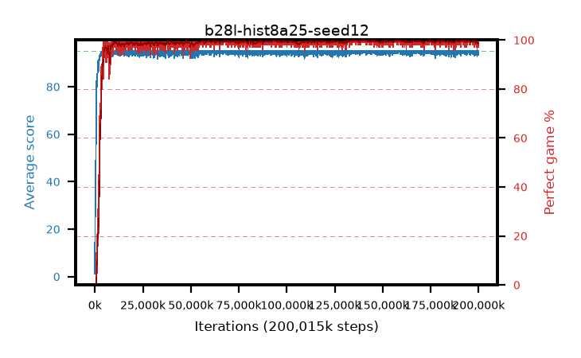

# b28l-hist8a25-seed12

step **200,015,872** · 6104 evals · trailing **94.32** · peak **94.96** @159,088,640 · sef **98.4** · best30 **99.9** @139,919,360

## Config

| | |
|---|---|
| algo | ppo |
| collect_envs | 128 |
| discount | 0.99 |
| eval_interval | 32768 |
| eval_queue | True |
| eval_queue_depth | 16 |
| eval_workers | 8 |
| fc_layers | (320,) |
| graph_eval_episodes | 100 |
| max_steps | 200015872 |
| min_checkpoint_score | 40.0 |
| ppo_adam_epsilon | 1e-07 |
| ppo_anneal_fraction | 0.25 |
| ppo_clip | 0.2 |
| ppo_clip_final | None |
| ppo_discount_final | 0.999 |
| ppo_entropy_coef | 0.01 |
| ppo_entropy_coef_final | 0.001 |
| ppo_epochs | 4 |
| ppo_gae_lambda | 0.95 |
| ppo_gae_lambda_final | 0.999 |
| ppo_gradient_clipping | 0.5 |
| ppo_horizon | 16.8 |
| ppo_horizon_final | 500.3 |
| ppo_learning_rate | 0.00025 |
| ppo_learning_rate_final | None |
| ppo_minibatch | 512 |
| ppo_normalize_adv | True |
| ppo_rollout | 256 |
| ppo_target_kl | 0.0 |
| ppo_transitions_per_rollout | 32768 |
| ppo_value_loss | huber |
| ppo_vf_coef | 0.5 |
| seed | 12 |
| torch_threads | 1 |

## Evals

| step | avg score | trailing avg | min score | max score | avg reward | perfect % | epsilon |
|---|---|---|---|---|---|---|---|
| 32768 | 1.22 | 1.22 | 0.0 | 13.0 | 0.666 | 0.0 |  |
| 65536 | 19.92 | 15.23 | 0.0 | 38.0 | 15.772 | 0.0 |  |
| 98304 | 23.41 | 17.27 | 0.0 | 51.0 | 18.918 | 0.0 |  |
| ... | ... | ... | ... | ... | ... | ... | ... |
| 199655424 | 93.6 | 94.38 | 9.0 | 95.0 | 190.297 | 98.0 |  |
| 199688192 | 93.85 | 94.35 | 30.0 | 95.0 | 190.588 | 98.0 |  |
| 199720960 | 94.56 | 94.32 | 51.0 | 95.0 | 192.298 | 99.0 |  |
| 199753728 | 94.41 | 94.33 | 36.0 | 95.0 | 192.148 | 99.0 |  |
| 199786496 | 94.2 | 94.29 | 15.0 | 95.0 | 191.943 | 99.0 |  |
| 199819264 | 94.26 | 94.28 | 21.0 | 95.0 | 191.993 | 99.0 |  |
| 199852032 | 93.29 | 94.23 | 6.0 | 95.0 | 188.994 | 97.0 |  |
| 199884800 | 95.0 | 94.27 | 95.0 | 95.0 | 193.77 | 100.0 |  |
| 199917568 | 95.0 | 94.28 | 95.0 | 95.0 | 193.781 | 100.0 |  |
| 199950336 | 95.0 | 94.3 | 95.0 | 95.0 | 193.775 | 100.0 |  |
| 199983104 | 94.57 | 94.27 | 52.0 | 95.0 | 192.349 | 99.0 |  |
| 200015872 | 93.91 | 94.32 | 33.0 | 95.0 | 190.694 | 98.0 |  |
