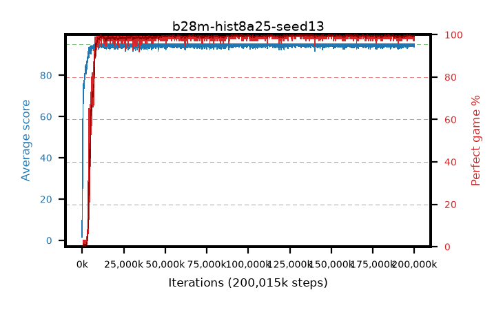

# b28m-hist8a25-seed13

step **200,015,872** · 6104 evals · trailing **94.69** · peak **94.92** @138,346,496 · sef **96.6** · best30 **99.8** @131,072,000

## Config

| | |
|---|---|
| algo | ppo |
| collect_envs | 128 |
| discount | 0.99 |
| eval_interval | 32768 |
| eval_queue | True |
| eval_queue_depth | 16 |
| eval_workers | 8 |
| fc_layers | (320,) |
| graph_eval_episodes | 100 |
| max_steps | 200015872 |
| min_checkpoint_score | 40.0 |
| ppo_adam_epsilon | 1e-07 |
| ppo_anneal_fraction | 0.25 |
| ppo_clip | 0.2 |
| ppo_clip_final | None |
| ppo_discount_final | 0.999 |
| ppo_entropy_coef | 0.01 |
| ppo_entropy_coef_final | 0.001 |
| ppo_epochs | 4 |
| ppo_gae_lambda | 0.95 |
| ppo_gae_lambda_final | 0.999 |
| ppo_gradient_clipping | 0.5 |
| ppo_horizon | 16.8 |
| ppo_horizon_final | 500.3 |
| ppo_learning_rate | 0.00025 |
| ppo_learning_rate_final | None |
| ppo_minibatch | 512 |
| ppo_normalize_adv | True |
| ppo_rollout | 256 |
| ppo_target_kl | 0.0 |
| ppo_transitions_per_rollout | 32768 |
| ppo_value_loss | huber |
| ppo_vf_coef | 0.5 |
| seed | 13 |
| torch_threads | 1 |

## Evals

| step | avg score | trailing avg | min score | max score | avg reward | perfect % | epsilon |
|---|---|---|---|---|---|---|---|
| 32768 | 1.59 | 1.59 | 0.0 | 7.0 | -0.402 | 0.0 |  |
| 65536 | 10.86 | 11.5 | 0.0 | 31.0 | 7.542 | 0.0 |  |
| 98304 | 22.06 | 11.82 | 1.0 | 43.0 | 17.538 | 0.0 |  |
| ... | ... | ... | ... | ... | ... | ... | ... |
| 199655424 | 95.0 | 94.72 | 95.0 | 95.0 | 193.779 | 100.0 |  |
| 199688192 | 94.52 | 94.68 | 47.0 | 95.0 | 192.255 | 99.0 |  |
| 199720960 | 95.0 | 94.7 | 95.0 | 95.0 | 193.776 | 100.0 |  |
| 199753728 | 93.74 | 94.67 | 10.0 | 95.0 | 189.494 | 97.0 |  |
| 199786496 | 95.0 | 94.7 | 95.0 | 95.0 | 193.785 | 100.0 |  |
| 199819264 | 94.84 | 94.71 | 79.0 | 95.0 | 192.578 | 99.0 |  |
| 199852032 | 95.0 | 94.7 | 95.0 | 95.0 | 193.781 | 100.0 |  |
| 199884800 | 94.58 | 94.72 | 53.0 | 95.0 | 192.365 | 99.0 |  |
| 199917568 | 93.84 | 94.68 | 30.0 | 95.0 | 190.584 | 98.0 |  |
| 199950336 | 95.0 | 94.7 | 95.0 | 95.0 | 193.781 | 100.0 |  |
| 199983104 | 94.17 | 94.7 | 12.0 | 95.0 | 191.905 | 99.0 |  |
| 200015872 | 94.19 | 94.69 | 14.0 | 95.0 | 191.975 | 99.0 |  |
