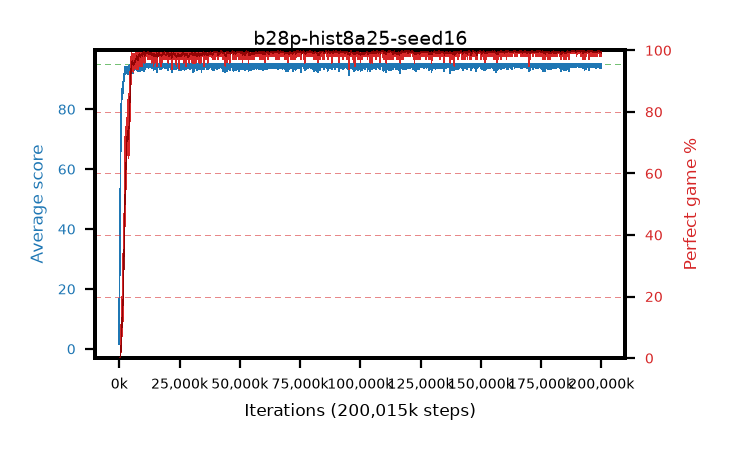

# b28p-hist8a25-seed16

step **200,015,872** · 6104 evals · trailing **94.66** · peak **94.93** @196,083,712 · sef **98.0** · best30 **99.9** @196,050,944

## Config

| | |
|---|---|
| algo | ppo |
| collect_envs | 128 |
| discount | 0.99 |
| eval_interval | 32768 |
| eval_queue | True |
| eval_queue_depth | 16 |
| eval_workers | 8 |
| fc_layers | (320,) |
| graph_eval_episodes | 100 |
| max_steps | 200015872 |
| min_checkpoint_score | 40.0 |
| ppo_adam_epsilon | 1e-07 |
| ppo_anneal_fraction | 0.25 |
| ppo_clip | 0.2 |
| ppo_clip_final | None |
| ppo_discount_final | 0.999 |
| ppo_entropy_coef | 0.01 |
| ppo_entropy_coef_final | 0.001 |
| ppo_epochs | 4 |
| ppo_gae_lambda | 0.95 |
| ppo_gae_lambda_final | 0.999 |
| ppo_gradient_clipping | 0.5 |
| ppo_horizon | 16.8 |
| ppo_horizon_final | 500.3 |
| ppo_learning_rate | 0.00025 |
| ppo_learning_rate_final | None |
| ppo_minibatch | 512 |
| ppo_normalize_adv | True |
| ppo_rollout | 256 |
| ppo_target_kl | 0.0 |
| ppo_transitions_per_rollout | 32768 |
| ppo_value_loss | huber |
| ppo_vf_coef | 0.5 |
| seed | 16 |
| torch_threads | 1 |

## Evals

| step | avg score | trailing avg | min score | max score | avg reward | perfect % | epsilon |
|---|---|---|---|---|---|---|---|
| 32768 | 1.59 | 1.59 | 0.0 | 14.0 | -0.211 | 0.0 |  |
| 65536 | 22.52 | 12.05 | 1.0 | 41.0 | 17.851 | 0.0 |  |
| 98304 | 27.12 | 17.08 | 3.0 | 51.0 | 22.077 | 0.0 |  |
| ... | ... | ... | ... | ... | ... | ... | ... |
| 199655424 | 95.0 | 94.82 | 95.0 | 95.0 | 193.774 | 100.0 |  |
| 199688192 | 94.37 | 94.8 | 32.0 | 95.0 | 192.153 | 99.0 |  |
| 199720960 | 94.43 | 94.78 | 38.0 | 95.0 | 192.216 | 99.0 |  |
| 199753728 | 94.2 | 94.78 | 15.0 | 95.0 | 191.982 | 99.0 |  |
| 199786496 | 94.39 | 94.73 | 34.0 | 95.0 | 192.128 | 99.0 |  |
| 199819264 | 95.0 | 94.73 | 95.0 | 95.0 | 193.783 | 100.0 |  |
| 199852032 | 94.14 | 94.75 | 43.0 | 95.0 | 190.88 | 98.0 |  |
| 199884800 | 95.0 | 94.73 | 95.0 | 95.0 | 193.783 | 100.0 |  |
| 199917568 | 94.27 | 94.71 | 22.0 | 95.0 | 192.054 | 99.0 |  |
| 199950336 | 93.65 | 94.61 | 15.0 | 95.0 | 190.434 | 98.0 |  |
| 199983104 | 94.29 | 94.68 | 24.0 | 95.0 | 192.079 | 99.0 |  |
| 200015872 | 94.23 | 94.66 | 18.0 | 95.0 | 192.011 | 99.0 |  |
