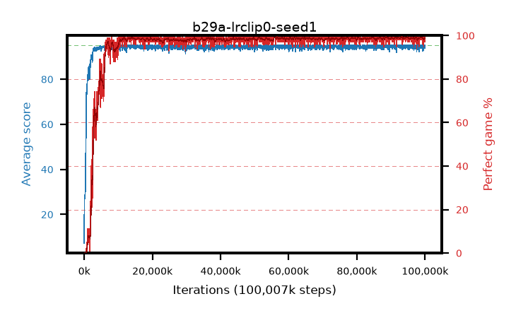

# b29a-lrclip0-seed1

step **100,007,936** · 3052 evals · trailing **94.44** · peak **94.75** @89,030,656 · sef **95.0** · best30 **99.3** @89,030,656

## Config

| | |
|---|---|
| algo | ppo |
| collect_envs | 128 |
| discount | 0.99 |
| eval_interval | 32768 |
| eval_queue | True |
| eval_queue_depth | 16 |
| eval_workers | 8 |
| fc_layers | (320,) |
| graph_eval_episodes | 100 |
| max_steps | 100007936 |
| min_checkpoint_score | 40.0 |
| ppo_adam_epsilon | 1e-07 |
| ppo_anneal_fraction | 1.0 |
| ppo_clip | 0.2 |
| ppo_clip_final | 0.001 |
| ppo_discount_final | None |
| ppo_entropy_coef | 0.01 |
| ppo_entropy_coef_final | None |
| ppo_epochs | 4 |
| ppo_gae_lambda | 0.95 |
| ppo_gae_lambda_final | None |
| ppo_gradient_clipping | 0.5 |
| ppo_horizon | 16.8 |
| ppo_learning_rate | 0.00025 |
| ppo_learning_rate_final | 0.0 |
| ppo_minibatch | 512 |
| ppo_normalize_adv | True |
| ppo_rollout | 256 |
| ppo_target_kl | 0.0 |
| ppo_transitions_per_rollout | 32768 |
| ppo_value_loss | huber |
| ppo_vf_coef | 0.5 |
| seed | 1 |
| torch_threads | 1 |

## Evals

| step | avg score | trailing avg | min score | max score | avg reward | perfect % | epsilon |
|---|---|---|---|---|---|---|---|
| 32768 | 7.26 | 7.26 | 0.0 | 18.0 | 2.515 | 0.0 |  |
| 65536 | 28.55 | 24.3 | 0.0 | 64.0 | 23.61 | 0.0 |  |
| 98304 | 28.5 | 17.88 | 1.0 | 52.0 | 23.499 | 0.0 |  |
| ... | ... | ... | ... | ... | ... | ... | ... |
| 99647488 | 94.45 | 94.49 | 40.0 | 95.0 | 192.212 | 99.0 |  |
| 99680256 | 95.0 | 94.45 | 95.0 | 95.0 | 193.741 | 100.0 |  |
| 99713024 | 94.32 | 94.42 | 61.0 | 95.0 | 191.076 | 98.0 |  |
| 99745792 | 94.27 | 94.41 | 22.0 | 95.0 | 192.033 | 99.0 |  |
| 99778560 | 95.0 | 94.42 | 95.0 | 95.0 | 193.753 | 100.0 |  |
| 99811328 | 94.9 | 94.46 | 85.0 | 95.0 | 192.655 | 99.0 |  |
| 99844096 | 94.4 | 94.45 | 55.0 | 95.0 | 191.157 | 98.0 |  |
| 99876864 | 95.0 | 94.45 | 95.0 | 95.0 | 193.752 | 100.0 |  |
| 99909632 | 94.27 | 94.44 | 46.0 | 95.0 | 189.996 | 97.0 |  |
| 99942400 | 95.0 | 94.44 | 95.0 | 95.0 | 193.751 | 100.0 |  |
| 99975168 | 93.84 | 94.44 | 20.0 | 95.0 | 190.597 | 98.0 |  |
| 100007936 | 94.46 | 94.44 | 49.0 | 95.0 | 191.17 | 98.0 |  |
