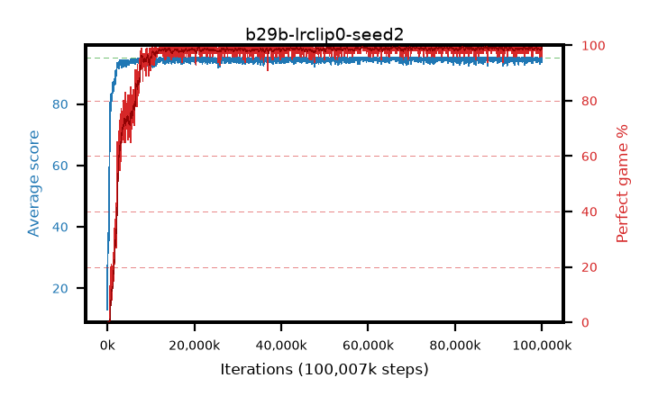

# b29b-lrclip0-seed2

step **100,007,936** · 3052 evals · trailing **94.37** · peak **94.75** @76,906,496 · sef **94.2** · best30 **99.4** @66,289,664

## Config

| | |
|---|---|
| algo | ppo |
| collect_envs | 128 |
| discount | 0.99 |
| eval_interval | 32768 |
| eval_queue | True |
| eval_queue_depth | 16 |
| eval_workers | 8 |
| fc_layers | (320,) |
| graph_eval_episodes | 100 |
| max_steps | 100007936 |
| min_checkpoint_score | 40.0 |
| ppo_adam_epsilon | 1e-07 |
| ppo_anneal_fraction | 1.0 |
| ppo_clip | 0.2 |
| ppo_clip_final | 0.001 |
| ppo_discount_final | None |
| ppo_entropy_coef | 0.01 |
| ppo_entropy_coef_final | None |
| ppo_epochs | 4 |
| ppo_gae_lambda | 0.95 |
| ppo_gae_lambda_final | None |
| ppo_gradient_clipping | 0.5 |
| ppo_horizon | 16.8 |
| ppo_learning_rate | 0.00025 |
| ppo_learning_rate_final | 0.0 |
| ppo_minibatch | 512 |
| ppo_normalize_adv | True |
| ppo_rollout | 256 |
| ppo_target_kl | 0.0 |
| ppo_transitions_per_rollout | 32768 |
| ppo_value_loss | huber |
| ppo_vf_coef | 0.5 |
| seed | 2 |
| torch_threads | 1 |

## Evals

| step | avg score | trailing avg | min score | max score | avg reward | perfect % | epsilon |
|---|---|---|---|---|---|---|---|
| 32768 | 13.01 | 13.01 | 1.0 | 31.0 | 8.257 | 0.0 |  |
| 65536 | 37.2 | 31.38 | 7.0 | 62.0 | 32.293 | 0.0 |  |
| 98304 | 34.74 | 26.81 | 1.0 | 63.0 | 29.788 | 0.0 |  |
| ... | ... | ... | ... | ... | ... | ... | ... |
| 99647488 | 95.0 | 94.38 | 95.0 | 95.0 | 193.76 | 100.0 |  |
| 99680256 | 94.47 | 94.36 | 60.0 | 95.0 | 191.221 | 98.0 |  |
| 99713024 | 93.93 | 94.36 | 20.0 | 95.0 | 190.697 | 98.0 |  |
| 99745792 | 95.0 | 94.37 | 95.0 | 95.0 | 193.751 | 100.0 |  |
| 99778560 | 95.0 | 94.39 | 95.0 | 95.0 | 193.751 | 100.0 |  |
| 99811328 | 94.08 | 94.35 | 38.0 | 95.0 | 190.849 | 98.0 |  |
| 99844096 | 94.38 | 94.41 | 59.0 | 95.0 | 191.132 | 98.0 |  |
| 99876864 | 94.21 | 94.38 | 16.0 | 95.0 | 191.972 | 99.0 |  |
| 99909632 | 95.0 | 94.41 | 95.0 | 95.0 | 193.759 | 100.0 |  |
| 99942400 | 95.0 | 94.39 | 95.0 | 95.0 | 193.748 | 100.0 |  |
| 99975168 | 93.62 | 94.36 | 36.0 | 95.0 | 188.383 | 96.0 |  |
| 100007936 | 93.75 | 94.37 | 12.0 | 95.0 | 190.505 | 98.0 |  |
