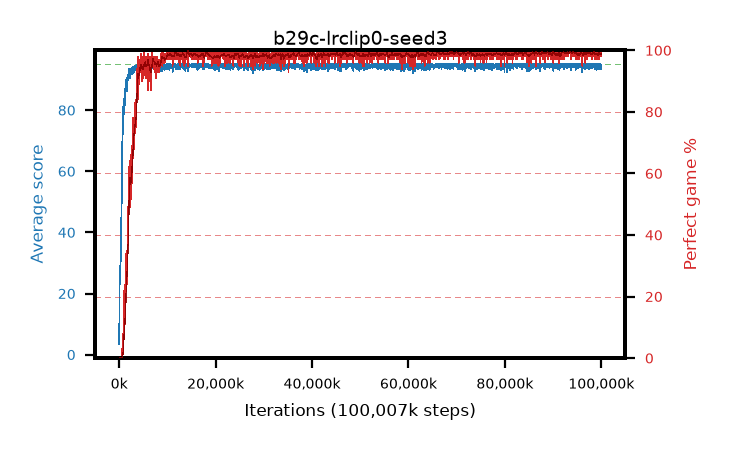

# b29c-lrclip0-seed3

step **100,007,936** · 3052 evals · trailing **94.52** · peak **94.76** @70,254,592 · sef **96.7** · best30 **99.4** @94,076,928

## Config

| | |
|---|---|
| algo | ppo |
| collect_envs | 128 |
| discount | 0.99 |
| eval_interval | 32768 |
| eval_queue | True |
| eval_queue_depth | 16 |
| eval_workers | 8 |
| fc_layers | (320,) |
| graph_eval_episodes | 100 |
| max_steps | 100007936 |
| min_checkpoint_score | 40.0 |
| ppo_adam_epsilon | 1e-07 |
| ppo_anneal_fraction | 1.0 |
| ppo_clip | 0.2 |
| ppo_clip_final | 0.001 |
| ppo_discount_final | None |
| ppo_entropy_coef | 0.01 |
| ppo_entropy_coef_final | None |
| ppo_epochs | 4 |
| ppo_gae_lambda | 0.95 |
| ppo_gae_lambda_final | None |
| ppo_gradient_clipping | 0.5 |
| ppo_horizon | 16.8 |
| ppo_learning_rate | 0.00025 |
| ppo_learning_rate_final | 0.0 |
| ppo_minibatch | 512 |
| ppo_normalize_adv | True |
| ppo_rollout | 256 |
| ppo_target_kl | 0.0 |
| ppo_transitions_per_rollout | 32768 |
| ppo_value_loss | huber |
| ppo_vf_coef | 0.5 |
| seed | 3 |
| torch_threads | 1 |

## Evals

| step | avg score | trailing avg | min score | max score | avg reward | perfect % | epsilon |
|---|---|---|---|---|---|---|---|
| 32768 | 3.45 | 3.45 | 0.0 | 9.0 | 0.92 | 0.0 |  |
| 65536 | 17.5 | 21.06 | 0.0 | 51.0 | 13.516 | 0.0 |  |
| 98304 | 26.9 | 22.03 | 1.0 | 52.0 | 22.011 | 0.0 |  |
| ... | ... | ... | ... | ... | ... | ... | ... |
| 99647488 | 95.0 | 94.48 | 95.0 | 95.0 | 193.751 | 100.0 |  |
| 99680256 | 94.42 | 94.5 | 59.0 | 95.0 | 191.177 | 98.0 |  |
| 99713024 | 94.31 | 94.51 | 57.0 | 95.0 | 191.027 | 98.0 |  |
| 99745792 | 93.54 | 94.49 | 16.0 | 95.0 | 190.298 | 98.0 |  |
| 99778560 | 94.61 | 94.5 | 56.0 | 95.0 | 192.363 | 99.0 |  |
| 99811328 | 95.0 | 94.45 | 95.0 | 95.0 | 193.752 | 100.0 |  |
| 99844096 | 94.13 | 94.51 | 8.0 | 95.0 | 191.841 | 99.0 |  |
| 99876864 | 93.42 | 94.44 | 10.0 | 95.0 | 190.18 | 98.0 |  |
| 99909632 | 94.6 | 94.47 | 58.0 | 95.0 | 191.317 | 98.0 |  |
| 99942400 | 94.66 | 94.47 | 61.0 | 95.0 | 192.407 | 99.0 |  |
| 99975168 | 94.67 | 94.46 | 62.0 | 95.0 | 192.43 | 99.0 |  |
| 100007936 | 94.88 | 94.52 | 83.0 | 95.0 | 192.594 | 99.0 |  |
