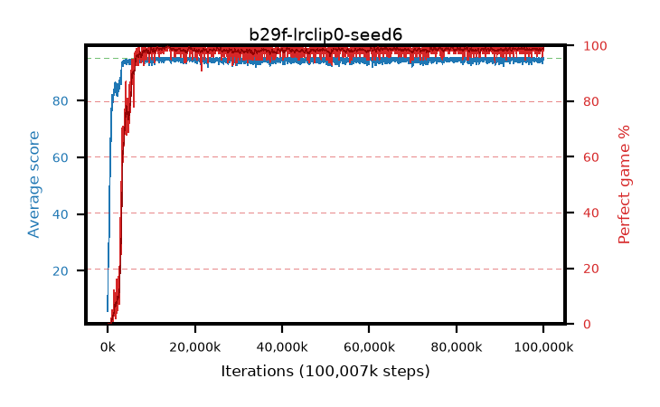

# b29f-lrclip0-seed6

step **100,007,936** · 3052 evals · trailing **94.46** · peak **94.89** @14,286,848 · sef **95.2** · best30 **99.6** @13,991,936

## Config

| | |
|---|---|
| algo | ppo |
| collect_envs | 128 |
| discount | 0.99 |
| eval_interval | 32768 |
| eval_queue | True |
| eval_queue_depth | 16 |
| eval_workers | 8 |
| fc_layers | (320,) |
| graph_eval_episodes | 100 |
| max_steps | 100007936 |
| min_checkpoint_score | 40.0 |
| ppo_adam_epsilon | 1e-07 |
| ppo_anneal_fraction | 1.0 |
| ppo_clip | 0.2 |
| ppo_clip_final | 0.001 |
| ppo_discount_final | None |
| ppo_entropy_coef | 0.01 |
| ppo_entropy_coef_final | None |
| ppo_epochs | 4 |
| ppo_gae_lambda | 0.95 |
| ppo_gae_lambda_final | None |
| ppo_gradient_clipping | 0.5 |
| ppo_horizon | 16.8 |
| ppo_learning_rate | 0.00025 |
| ppo_learning_rate_final | 0.0 |
| ppo_minibatch | 512 |
| ppo_normalize_adv | True |
| ppo_rollout | 256 |
| ppo_target_kl | 0.0 |
| ppo_transitions_per_rollout | 32768 |
| ppo_value_loss | huber |
| ppo_vf_coef | 0.5 |
| seed | 6 |
| torch_threads | 1 |

## Evals

| step | avg score | trailing avg | min score | max score | avg reward | perfect % | epsilon |
|---|---|---|---|---|---|---|---|
| 32768 | 5.72 | 5.72 | 0.0 | 13.0 | 2.106 | 0.0 |  |
| 65536 | 18.72 | 12.22 | 2.0 | 41.0 | 14.803 | 0.0 |  |
| 98304 | 24.17 | 16.2 | 2.0 | 46.0 | 19.347 | 0.0 |  |
| ... | ... | ... | ... | ... | ... | ... | ... |
| 99647488 | 94.67 | 94.39 | 62.0 | 95.0 | 192.426 | 99.0 |  |
| 99680256 | 93.13 | 94.38 | 10.0 | 95.0 | 187.896 | 96.0 |  |
| 99713024 | 94.19 | 94.39 | 14.0 | 95.0 | 191.942 | 99.0 |  |
| 99745792 | 95.0 | 94.41 | 95.0 | 95.0 | 193.748 | 100.0 |  |
| 99778560 | 95.0 | 94.41 | 95.0 | 95.0 | 193.755 | 100.0 |  |
| 99811328 | 93.97 | 94.38 | 16.0 | 95.0 | 190.733 | 98.0 |  |
| 99844096 | 95.0 | 94.4 | 95.0 | 95.0 | 193.754 | 100.0 |  |
| 99876864 | 95.0 | 94.42 | 95.0 | 95.0 | 193.752 | 100.0 |  |
| 99909632 | 94.91 | 94.43 | 86.0 | 95.0 | 192.677 | 99.0 |  |
| 99942400 | 94.77 | 94.43 | 82.0 | 95.0 | 191.519 | 98.0 |  |
| 99975168 | 94.48 | 94.46 | 66.0 | 95.0 | 191.235 | 98.0 |  |
| 100007936 | 95.0 | 94.46 | 95.0 | 95.0 | 193.749 | 100.0 |  |
