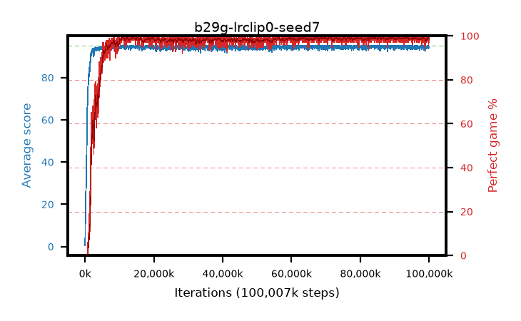

# b29g-lrclip0-seed7

step **100,007,936** · 3052 evals · trailing **94.51** · peak **94.69** @14,712,832 · sef **95.9** · best30 **99.2** @71,499,776

## Config

| | |
|---|---|
| algo | ppo |
| collect_envs | 128 |
| discount | 0.99 |
| eval_interval | 32768 |
| eval_queue | True |
| eval_queue_depth | 16 |
| eval_workers | 8 |
| fc_layers | (320,) |
| graph_eval_episodes | 100 |
| max_steps | 100007936 |
| min_checkpoint_score | 40.0 |
| ppo_adam_epsilon | 1e-07 |
| ppo_anneal_fraction | 1.0 |
| ppo_clip | 0.2 |
| ppo_clip_final | 0.001 |
| ppo_discount_final | None |
| ppo_entropy_coef | 0.01 |
| ppo_entropy_coef_final | None |
| ppo_epochs | 4 |
| ppo_gae_lambda | 0.95 |
| ppo_gae_lambda_final | None |
| ppo_gradient_clipping | 0.5 |
| ppo_horizon | 16.8 |
| ppo_learning_rate | 0.00025 |
| ppo_learning_rate_final | 0.0 |
| ppo_minibatch | 512 |
| ppo_normalize_adv | True |
| ppo_rollout | 256 |
| ppo_target_kl | 0.0 |
| ppo_transitions_per_rollout | 32768 |
| ppo_value_loss | huber |
| ppo_vf_coef | 0.5 |
| seed | 7 |
| torch_threads | 1 |

## Evals

| step | avg score | trailing avg | min score | max score | avg reward | perfect % | epsilon |
|---|---|---|---|---|---|---|---|
| 32768 | 0.53 | 0.53 | 0.0 | 3.0 | -0.022 | 0.0 |  |
| 65536 | 8.0 | 4.26 | 0.0 | 24.0 | 5.847 | 0.0 |  |
| 98304 | 15.73 | 8.09 | 1.0 | 34.0 | 11.087 | 0.0 |  |
| ... | ... | ... | ... | ... | ... | ... | ... |
| 99647488 | 94.83 | 94.36 | 78.0 | 95.0 | 192.58 | 99.0 |  |
| 99680256 | 94.35 | 94.34 | 30.0 | 95.0 | 192.106 | 99.0 |  |
| 99713024 | 94.48 | 94.47 | 43.0 | 95.0 | 192.187 | 99.0 |  |
| 99745792 | 95.0 | 94.51 | 95.0 | 95.0 | 193.75 | 100.0 |  |
| 99778560 | 94.78 | 94.36 | 73.0 | 95.0 | 192.535 | 99.0 |  |
| 99811328 | 94.32 | 94.39 | 61.0 | 95.0 | 190.996 | 98.0 |  |
| 99844096 | 93.58 | 94.43 | 43.0 | 95.0 | 188.301 | 96.0 |  |
| 99876864 | 95.0 | 94.51 | 95.0 | 95.0 | 193.757 | 100.0 |  |
| 99909632 | 94.51 | 94.52 | 62.0 | 95.0 | 191.267 | 98.0 |  |
| 99942400 | 94.81 | 94.52 | 76.0 | 95.0 | 192.559 | 99.0 |  |
| 99975168 | 94.68 | 94.53 | 63.0 | 95.0 | 192.433 | 99.0 |  |
| 100007936 | 94.56 | 94.51 | 69.0 | 95.0 | 190.28 | 97.0 |  |
