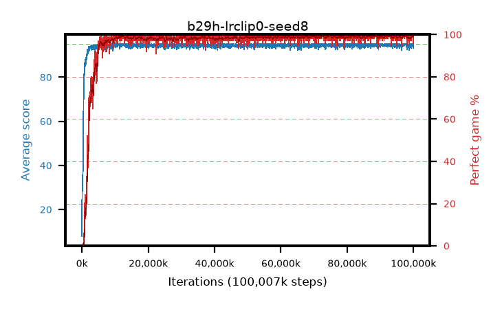

# b29h-lrclip0-seed8

step **100,007,936** · 3052 evals · trailing **94.51** · peak **94.78** @97,746,944 · sef **96.6** · best30 **99.5** @88,834,048

## Config

| | |
|---|---|
| algo | ppo |
| collect_envs | 128 |
| discount | 0.99 |
| eval_interval | 32768 |
| eval_queue | True |
| eval_queue_depth | 16 |
| eval_workers | 8 |
| fc_layers | (320,) |
| graph_eval_episodes | 100 |
| max_steps | 100007936 |
| min_checkpoint_score | 40.0 |
| ppo_adam_epsilon | 1e-07 |
| ppo_anneal_fraction | 1.0 |
| ppo_clip | 0.2 |
| ppo_clip_final | 0.001 |
| ppo_discount_final | None |
| ppo_entropy_coef | 0.01 |
| ppo_entropy_coef_final | None |
| ppo_epochs | 4 |
| ppo_gae_lambda | 0.95 |
| ppo_gae_lambda_final | None |
| ppo_gradient_clipping | 0.5 |
| ppo_horizon | 16.8 |
| ppo_learning_rate | 0.00025 |
| ppo_learning_rate_final | 0.0 |
| ppo_minibatch | 512 |
| ppo_normalize_adv | True |
| ppo_rollout | 256 |
| ppo_target_kl | 0.0 |
| ppo_transitions_per_rollout | 32768 |
| ppo_value_loss | huber |
| ppo_vf_coef | 0.5 |
| seed | 8 |
| torch_threads | 1 |

## Evals

| step | avg score | trailing avg | min score | max score | avg reward | perfect % | epsilon |
|---|---|---|---|---|---|---|---|
| 32768 | 7.84 | 7.84 | 0.0 | 27.0 | 5.256 | 0.0 |  |
| 65536 | 35.55 | 28.44 | 0.0 | 83.0 | 30.931 | 0.0 |  |
| 98304 | 34.63 | 26.22 | 5.0 | 55.0 | 29.595 | 0.0 |  |
| ... | ... | ... | ... | ... | ... | ... | ... |
| 99647488 | 94.62 | 94.46 | 57.0 | 95.0 | 192.334 | 99.0 |  |
| 99680256 | 94.69 | 94.32 | 64.0 | 95.0 | 192.45 | 99.0 |  |
| 99713024 | 95.0 | 94.39 | 95.0 | 95.0 | 193.755 | 100.0 |  |
| 99745792 | 95.0 | 94.47 | 95.0 | 95.0 | 193.749 | 100.0 |  |
| 99778560 | 94.2 | 94.47 | 15.0 | 95.0 | 191.912 | 99.0 |  |
| 99811328 | 94.73 | 94.47 | 68.0 | 95.0 | 192.487 | 99.0 |  |
| 99844096 | 94.49 | 94.46 | 44.0 | 95.0 | 192.251 | 99.0 |  |
| 99876864 | 95.0 | 94.5 | 95.0 | 95.0 | 193.76 | 100.0 |  |
| 99909632 | 94.73 | 94.57 | 68.0 | 95.0 | 192.486 | 99.0 |  |
| 99942400 | 94.71 | 94.53 | 66.0 | 95.0 | 192.469 | 99.0 |  |
| 99975168 | 94.21 | 94.54 | 16.0 | 95.0 | 191.968 | 99.0 |  |
| 100007936 | 93.16 | 94.51 | 30.0 | 95.0 | 187.932 | 96.0 |  |
