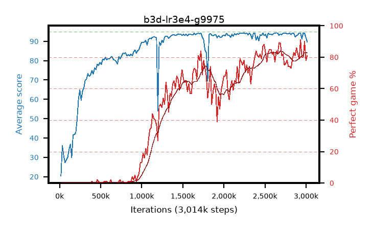

# b3d-lr3e4-g9975

step **3,014,656** · 184 evals · trailing **93.52** · peak **93.64** @2,949,120 · sef **16.3** · best30 **81.6** @2,949,120

## Config

| | |
|---|---|
| algo | ppo |
| collect_envs | 128 |
| discount | 0.9975 |
| eval_interval | 16384 |
| eval_queue | True |
| eval_queue_depth | 16 |
| eval_workers | 6 |
| fc_layers | (320,) |
| graph_eval_episodes | 100 |
| max_steps | 3000000 |
| min_checkpoint_score | 40.0 |
| ppo_adam_epsilon | 1e-07 |
| ppo_clip | 0.2 |
| ppo_entropy_coef | 0.01 |
| ppo_entropy_coef_final | None |
| ppo_epochs | 4 |
| ppo_gae_lambda | 0.98 |
| ppo_gradient_clipping | 0.5 |
| ppo_horizon | 44.5 |
| ppo_learning_rate | 0.0003 |
| ppo_minibatch | 256 |
| ppo_normalize_adv | True |
| ppo_rollout | 128 |
| ppo_target_kl | 0.0 |
| ppo_transitions_per_rollout | 16384 |
| ppo_value_loss | huber |
| ppo_vf_coef | 0.5 |
| seed | 1 |
| torch_threads | 1 |

## Evals

| step | avg score | trailing avg | min score | max score | avg reward | perfect % | epsilon |
|---|---|---|---|---|---|---|---|
| 16384 | 20.41 | 20.41 | 3.0 | 37.0 | 16.76 | 0.0 |  |
| 32768 | 35.99 | 29.66 | 15.0 | 70.0 | 30.99 | 0.0 |  |
| 49152 | 30.98 | 27.17 | 3.0 | 58.0 | 26.07 | 0.0 |  |
| ... | ... | ... | ... | ... | ... | ... | ... |
| 2834432 | 94.19 | 93.49 | 80.0 | 95.0 | 172.295 | 79.0 |  |
| 2850816 | 94.1 | 93.61 | 56.0 | 95.0 | 176.185 | 83.0 |  |
| 2867200 | 92.38 | 93.6 | 28.0 | 95.0 | 172.475 | 81.0 |  |
| 2883584 | 92.97 | 93.62 | 29.0 | 95.0 | 178.04 | 86.0 |  |
| 2899968 | 93.35 | 93.45 | 18.0 | 95.0 | 174.44 | 82.0 |  |
| 2916352 | 94.31 | 93.47 | 88.0 | 95.0 | 172.415 | 79.0 |  |
| 2932736 | 94.22 | 93.56 | 61.0 | 95.0 | 184.265 | 91.0 |  |
| 2949120 | 91.31 | 93.64 | 28.0 | 95.0 | 170.41 | 80.0 |  |
| 2965504 | 94.35 | 93.49 | 88.0 | 95.0 | 173.36 | 80.0 |  |
| 2981888 | 94.15 | 93.49 | 58.0 | 95.0 | 183.2 | 90.0 |  |
| 2998272 | 91.9 | 93.44 | 29.0 | 95.0 | 168.965 | 78.0 |  |
| 3014656 | 89.68 | 93.52 | 25.0 | 95.0 | 169.775 | 81.0 |  |
