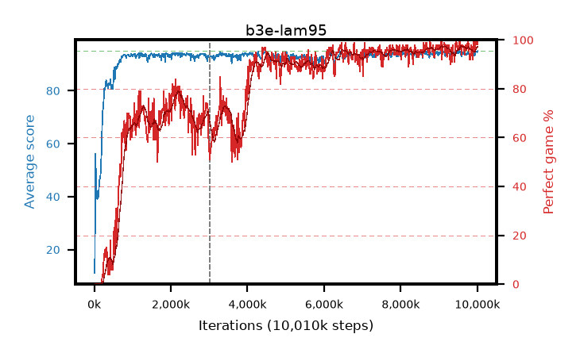

# b3e-lam95

step **10,010,624** · 611 evals · trailing **94.19** · peak **94.26** @9,551,872 · sef **61.7** · best30 **96.8** @9,142,272

## Config

| | |
|---|---|
| algo | ppo |
| collect_envs | 128 |
| discount | 0.99 |
| eval_interval | 16384 |
| eval_queue | True |
| eval_queue_depth | 16 |
| eval_workers | 6 |
| fc_layers | (320,) |
| graph_eval_episodes | 100 |
| max_steps | 10000000 |
| min_checkpoint_score | 40.0 |
| ppo_adam_epsilon | 1e-07 |
| ppo_clip | 0.2 |
| ppo_entropy_coef | 0.01 |
| ppo_entropy_coef_final | None |
| ppo_epochs | 4 |
| ppo_gae_lambda | 0.95 |
| ppo_gradient_clipping | 0.5 |
| ppo_horizon | 16.8 |
| ppo_learning_rate | 0.0003 |
| ppo_minibatch | 256 |
| ppo_normalize_adv | True |
| ppo_rollout | 128 |
| ppo_target_kl | 0.0 |
| ppo_transitions_per_rollout | 16384 |
| ppo_value_loss | huber |
| ppo_vf_coef | 0.5 |
| seed | 1 |
| torch_threads | 1 |

## Resumes

Resumed at 3,014,656

## Evals

| step | avg score | trailing avg | min score | max score | avg reward | perfect % | epsilon |
|---|---|---|---|---|---|---|---|
| 16384 | 11.16 | 11.16 | 0.0 | 27.0 | 10.21 | 0.0 |  |
| 32768 | 56.09 | 39.39 | 14.0 | 80.0 | 51.36 | 0.0 |  |
| 49152 | 47.02 | 32.36 | 14.0 | 73.0 | 42.2 | 0.0 |  |
| ... | ... | ... | ... | ... | ... | ... | ... |
| 9830400 | 94.04 | 94.1 | 65.0 | 95.0 | 187.07 | 94.0 |  |
| 9846784 | 94.81 | 94.14 | 83.0 | 95.0 | 191.82 | 98.0 |  |
| 9863168 | 93.88 | 94.09 | 57.0 | 95.0 | 186.91 | 94.0 |  |
| 9879552 | 92.24 | 94.12 | 24.0 | 95.0 | 183.28 | 92.0 |  |
| 9895936 | 94.15 | 94.08 | 62.0 | 95.0 | 190.165 | 97.0 |  |
| 9912320 | 95.0 | 94.1 | 95.0 | 95.0 | 194.0 | 100.0 |  |
| 9928704 | 93.21 | 94.17 | 24.0 | 95.0 | 187.235 | 95.0 |  |
| 9945088 | 94.68 | 94.19 | 63.0 | 95.0 | 192.685 | 99.0 |  |
| 9961472 | 94.77 | 94.19 | 72.0 | 95.0 | 192.775 | 99.0 |  |
| 9977856 | 94.84 | 94.14 | 79.0 | 95.0 | 192.845 | 99.0 |  |
| 9994240 | 94.55 | 94.19 | 53.0 | 95.0 | 191.56 | 98.0 |  |
| 10010624 | 95.0 | 94.19 | 95.0 | 95.0 | 194.0 | 100.0 |  |
