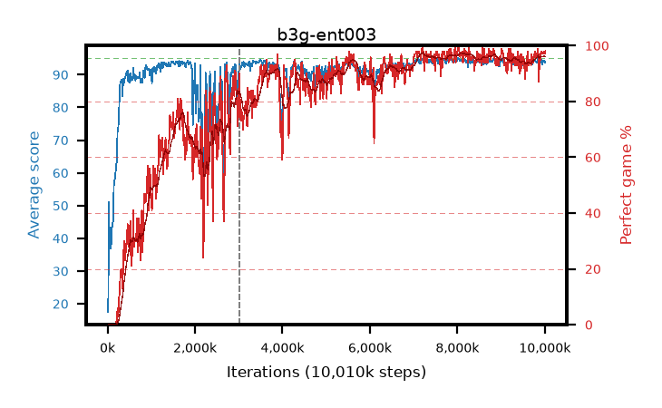

# b3g-ent003

step **10,010,624** · 611 evals · trailing **93.74** · peak **94.28** @8,028,160 · sef **70.0** · best30 **96.9** @8,290,304

## Config

| | |
|---|---|
| algo | ppo |
| collect_envs | 128 |
| discount | 0.99 |
| eval_interval | 16384 |
| eval_queue | True |
| eval_queue_depth | 16 |
| eval_workers | 6 |
| fc_layers | (320,) |
| graph_eval_episodes | 100 |
| max_steps | 10000000 |
| min_checkpoint_score | 40.0 |
| ppo_adam_epsilon | 1e-07 |
| ppo_clip | 0.2 |
| ppo_entropy_coef | 0.003 |
| ppo_entropy_coef_final | None |
| ppo_epochs | 4 |
| ppo_gae_lambda | 0.98 |
| ppo_gradient_clipping | 0.5 |
| ppo_horizon | 33.6 |
| ppo_learning_rate | 0.0003 |
| ppo_minibatch | 256 |
| ppo_normalize_adv | True |
| ppo_rollout | 128 |
| ppo_target_kl | 0.0 |
| ppo_transitions_per_rollout | 16384 |
| ppo_value_loss | huber |
| ppo_vf_coef | 0.5 |
| seed | 1 |
| torch_threads | 1 |

## Resumes

Resumed at 3,014,656

## Evals

| step | avg score | trailing avg | min score | max score | avg reward | perfect % | epsilon |
|---|---|---|---|---|---|---|---|
| 16384 | 17.49 | 17.49 | 1.0 | 38.0 | 14.83 | 0.0 |  |
| 32768 | 51.05 | 37.34 | 14.0 | 91.0 | 46.41 | 0.0 |  |
| 49152 | 38.33 | 27.91 | 14.0 | 67.0 | 33.33 | 0.0 |  |
| ... | ... | ... | ... | ... | ... | ... | ... |
| 9830400 | 94.1 | 93.89 | 18.0 | 95.0 | 190.115 | 97.0 |  |
| 9846784 | 94.97 | 93.92 | 92.0 | 95.0 | 192.975 | 99.0 |  |
| 9863168 | 91.11 | 93.83 | 14.0 | 95.0 | 177.13 | 87.0 |  |
| 9879552 | 94.71 | 93.91 | 72.0 | 95.0 | 190.68 | 97.0 |  |
| 9895936 | 93.56 | 93.93 | 43.0 | 95.0 | 187.54 | 95.0 |  |
| 9912320 | 94.26 | 93.64 | 54.0 | 95.0 | 191.27 | 98.0 |  |
| 9928704 | 94.51 | 93.76 | 75.0 | 95.0 | 190.525 | 97.0 |  |
| 9945088 | 93.15 | 93.69 | 18.0 | 95.0 | 189.165 | 97.0 |  |
| 9961472 | 94.25 | 93.84 | 56.0 | 95.0 | 190.265 | 97.0 |  |
| 9977856 | 94.26 | 93.73 | 57.0 | 95.0 | 191.27 | 98.0 |  |
| 9994240 | 94.15 | 93.72 | 22.0 | 95.0 | 190.165 | 97.0 |  |
| 10010624 | 93.72 | 93.74 | 30.0 | 95.0 | 190.73 | 98.0 |  |
