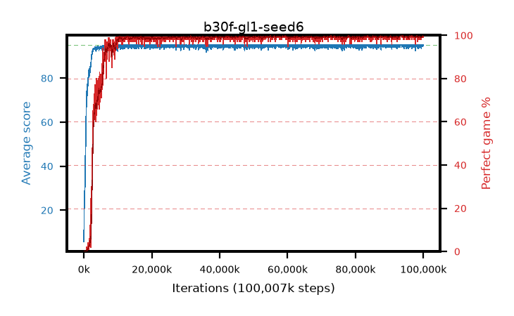

# b30f-gl1-seed6

step **100,007,936** · 3052 evals · trailing **94.61** · peak **94.92** @93,880,320 · sef **94.9** · best30 **99.8** @93,782,016

## Config

| | |
|---|---|
| algo | ppo |
| collect_envs | 128 |
| discount | 0.99 |
| eval_interval | 32768 |
| eval_queue | True |
| eval_queue_depth | 16 |
| eval_workers | 8 |
| fc_layers | (320,) |
| graph_eval_episodes | 100 |
| max_steps | 100007936 |
| min_checkpoint_score | 40.0 |
| ppo_adam_epsilon | 1e-07 |
| ppo_anneal_fraction | 0.5 |
| ppo_clip | 0.2 |
| ppo_clip_final | None |
| ppo_discount_final | 1.0 |
| ppo_entropy_coef | 0.01 |
| ppo_entropy_coef_final | 0.001 |
| ppo_epochs | 4 |
| ppo_gae_lambda | 0.95 |
| ppo_gae_lambda_final | 1.0 |
| ppo_gradient_clipping | 0.5 |
| ppo_horizon | 16.8 |
| ppo_horizon_final | inf |
| ppo_learning_rate | 0.00025 |
| ppo_learning_rate_final | None |
| ppo_minibatch | 512 |
| ppo_normalize_adv | True |
| ppo_rollout | 256 |
| ppo_target_kl | 0.0 |
| ppo_transitions_per_rollout | 32768 |
| ppo_value_loss | huber |
| ppo_vf_coef | 0.5 |
| seed | 6 |
| torch_threads | 1 |

## Evals

| step | avg score | trailing avg | min score | max score | avg reward | perfect % | epsilon |
|---|---|---|---|---|---|---|---|
| 32768 | 5.7 | 5.7 | 0.0 | 12.0 | 2.169 | 0.0 |  |
| 65536 | 18.0 | 17.04 | 0.0 | 43.0 | 13.837 | 0.0 |  |
| 98304 | 23.9 | 18.75 | 5.0 | 43.0 | 18.99 | 0.0 |  |
| ... | ... | ... | ... | ... | ... | ... | ... |
| 99647488 | 95.0 | 94.57 | 95.0 | 95.0 | 193.757 | 100.0 |  |
| 99680256 | 95.0 | 94.57 | 95.0 | 95.0 | 193.769 | 100.0 |  |
| 99713024 | 94.71 | 94.59 | 66.0 | 95.0 | 192.444 | 99.0 |  |
| 99745792 | 95.0 | 94.61 | 95.0 | 95.0 | 193.76 | 100.0 |  |
| 99778560 | 95.0 | 94.61 | 95.0 | 95.0 | 193.76 | 100.0 |  |
| 99811328 | 94.46 | 94.59 | 41.0 | 95.0 | 192.186 | 99.0 |  |
| 99844096 | 95.0 | 94.61 | 95.0 | 95.0 | 193.76 | 100.0 |  |
| 99876864 | 94.59 | 94.61 | 54.0 | 95.0 | 192.361 | 99.0 |  |
| 99909632 | 95.0 | 94.67 | 95.0 | 95.0 | 193.767 | 100.0 |  |
| 99942400 | 95.0 | 94.64 | 95.0 | 95.0 | 193.769 | 100.0 |  |
| 99975168 | 95.0 | 94.67 | 95.0 | 95.0 | 193.762 | 100.0 |  |
| 100007936 | 95.0 | 94.61 | 95.0 | 95.0 | 193.761 | 100.0 |  |
