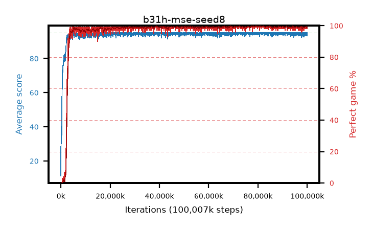

# b31h-mse-seed8

step **100,007,936** · 3052 evals · trailing **94.48** · peak **94.91** @82,411,520 · sef **97.2** · best30 **99.8** @79,527,936

## Config

| | |
|---|---|
| algo | ppo |
| collect_envs | 128 |
| discount | 0.99 |
| eval_interval | 32768 |
| eval_queue | True |
| eval_queue_depth | 16 |
| eval_workers | 8 |
| fc_layers | (320,) |
| graph_eval_episodes | 100 |
| max_steps | 100007936 |
| min_checkpoint_score | 40.0 |
| ppo_adam_epsilon | 1e-07 |
| ppo_anneal_fraction | 0.5 |
| ppo_clip | 0.2 |
| ppo_clip_final | None |
| ppo_discount_final | 0.999 |
| ppo_entropy_coef | 0.01 |
| ppo_entropy_coef_final | 0.001 |
| ppo_epochs | 4 |
| ppo_gae_lambda | 0.95 |
| ppo_gae_lambda_final | 0.999 |
| ppo_gradient_clipping | 0.5 |
| ppo_horizon | 16.8 |
| ppo_horizon_final | 500.3 |
| ppo_learning_rate | 0.00025 |
| ppo_learning_rate_final | None |
| ppo_minibatch | 512 |
| ppo_normalize_adv | True |
| ppo_rollout | 256 |
| ppo_target_kl | 0.0 |
| ppo_transitions_per_rollout | 32768 |
| ppo_value_loss | mse |
| ppo_vf_coef | 0.5 |
| seed | 8 |
| torch_threads | 1 |

## Evals

| step | avg score | trailing avg | min score | max score | avg reward | perfect % | epsilon |
|---|---|---|---|---|---|---|---|
| 32768 | 11.28 | 11.28 | 0.0 | 29.0 | 7.881 | 0.0 |  |
| 65536 | 40.29 | 30.34 | 0.0 | 67.0 | 35.239 | 0.0 |  |
| 98304 | 36.31 | 23.8 | 5.0 | 65.0 | 31.222 | 0.0 |  |
| ... | ... | ... | ... | ... | ... | ... | ... |
| 99647488 | 93.91 | 94.55 | 39.0 | 95.0 | 190.61 | 98.0 |  |
| 99680256 | 93.44 | 94.5 | 14.0 | 95.0 | 190.227 | 98.0 |  |
| 99713024 | 93.71 | 94.51 | 28.0 | 95.0 | 190.413 | 98.0 |  |
| 99745792 | 95.0 | 94.53 | 95.0 | 95.0 | 193.766 | 100.0 |  |
| 99778560 | 94.74 | 94.54 | 69.0 | 95.0 | 192.511 | 99.0 |  |
| 99811328 | 94.36 | 94.49 | 31.0 | 95.0 | 192.095 | 99.0 |  |
| 99844096 | 95.0 | 94.54 | 95.0 | 95.0 | 193.776 | 100.0 |  |
| 99876864 | 94.49 | 94.56 | 44.0 | 95.0 | 192.22 | 99.0 |  |
| 99909632 | 94.36 | 94.55 | 31.0 | 95.0 | 192.095 | 99.0 |  |
| 99942400 | 95.0 | 94.57 | 95.0 | 95.0 | 193.773 | 100.0 |  |
| 99975168 | 94.13 | 94.54 | 41.0 | 95.0 | 190.821 | 98.0 |  |
| 100007936 | 93.43 | 94.48 | 15.0 | 95.0 | 190.174 | 98.0 |  |
