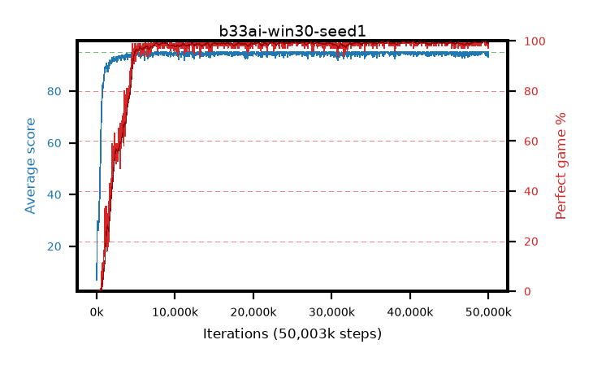

# b33ai-win30-seed1

step **50,003,968** · 1526 evals · trailing **94.74** · peak **94.8** @39,878,656 · sef **91.9** · best30 **99.6** @39,616,512

## Config

| | |
|---|---|
| algo | ppo |
| collect_envs | 128 |
| discount | 0.99 |
| eval_interval | 32768 |
| eval_queue | True |
| eval_queue_depth | 16 |
| eval_workers | 8 |
| fc_layers | (320,) |
| graph_eval_episodes | 100 |
| init_from | None |
| max_steps | 50003968 |
| min_checkpoint_score | 40.0 |
| ppo_adam_epsilon | 1e-07 |
| ppo_anneal_fraction | 0.5 |
| ppo_clip | 0.2 |
| ppo_clip_final | None |
| ppo_discount_final | 0.999 |
| ppo_entropy_coef | 0.01 |
| ppo_entropy_coef_final | 0.001 |
| ppo_epochs | 4 |
| ppo_gae_lambda | 0.95 |
| ppo_gae_lambda_final | 0.999 |
| ppo_gradient_clipping | 0.5 |
| ppo_horizon | 16.8 |
| ppo_horizon_final | 500.3 |
| ppo_learning_rate | 0.00025 |
| ppo_learning_rate_final | None |
| ppo_minibatch | 512 |
| ppo_normalize_adv | True |
| ppo_rollout | 256 |
| ppo_target_kl | 0.0 |
| ppo_transitions_per_rollout | 32768 |
| ppo_value_loss | huber |
| ppo_vf_coef | 0.5 |
| seed | 1 |
| torch_threads | 1 |

## Evals

| step | avg score | trailing avg | min score | max score | avg reward | perfect % | epsilon |
|---|---|---|---|---|---|---|---|
| 32768 | 6.97 | 6.97 | 0.0 | 17.0 | 2.181 | 0.0 |  |
| 65536 | 29.69 | 18.33 | 1.0 | 58.0 | 24.914 | 0.0 |  |
| 98304 | 29.4 | 22.02 | 1.0 | 52.0 | 24.391 | 0.0 |  |
| ... | ... | ... | ... | ... | ... | ... | ... |
| 49643520 | 95.0 | 94.73 | 95.0 | 95.0 | 193.765 | 100.0 |  |
| 49676288 | 95.0 | 94.76 | 95.0 | 95.0 | 193.766 | 100.0 |  |
| 49709056 | 94.19 | 94.74 | 14.0 | 95.0 | 191.953 | 99.0 |  |
| 49741824 | 94.55 | 94.75 | 50.0 | 95.0 | 192.323 | 99.0 |  |
| 49774592 | 95.0 | 94.73 | 95.0 | 95.0 | 193.762 | 100.0 |  |
| 49807360 | 94.09 | 94.73 | 43.0 | 95.0 | 190.812 | 98.0 |  |
| 49840128 | 95.0 | 94.79 | 95.0 | 95.0 | 193.764 | 100.0 |  |
| 49872896 | 93.54 | 94.71 | 12.0 | 95.0 | 190.312 | 98.0 |  |
| 49905664 | 95.0 | 94.73 | 95.0 | 95.0 | 193.766 | 100.0 |  |
| 49938432 | 95.0 | 94.73 | 95.0 | 95.0 | 193.759 | 100.0 |  |
| 49971200 | 95.0 | 94.76 | 95.0 | 95.0 | 193.765 | 100.0 |  |
| 50003968 | 93.2 | 94.74 | 16.0 | 95.0 | 188.936 | 97.0 |  |
