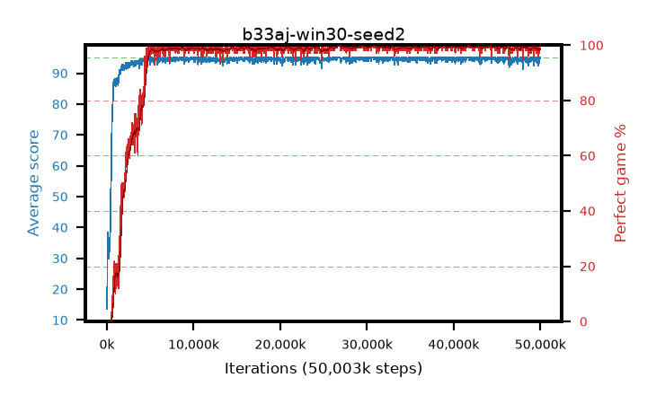

# b33aj-win30-seed2

step **50,003,968** · 1526 evals · trailing **94.29** · peak **94.85** @26,902,528 · sef **92.1** · best30 **99.6** @30,998,528

## Config

| | |
|---|---|
| algo | ppo |
| collect_envs | 128 |
| discount | 0.99 |
| eval_interval | 32768 |
| eval_queue | True |
| eval_queue_depth | 16 |
| eval_workers | 8 |
| fc_layers | (320,) |
| graph_eval_episodes | 100 |
| init_from | None |
| max_steps | 50003968 |
| min_checkpoint_score | 40.0 |
| ppo_adam_epsilon | 1e-07 |
| ppo_anneal_fraction | 0.5 |
| ppo_clip | 0.2 |
| ppo_clip_final | None |
| ppo_discount_final | 0.999 |
| ppo_entropy_coef | 0.01 |
| ppo_entropy_coef_final | 0.001 |
| ppo_epochs | 4 |
| ppo_gae_lambda | 0.95 |
| ppo_gae_lambda_final | 0.999 |
| ppo_gradient_clipping | 0.5 |
| ppo_horizon | 16.8 |
| ppo_horizon_final | 500.3 |
| ppo_learning_rate | 0.00025 |
| ppo_learning_rate_final | None |
| ppo_minibatch | 512 |
| ppo_normalize_adv | True |
| ppo_rollout | 256 |
| ppo_target_kl | 0.0 |
| ppo_transitions_per_rollout | 32768 |
| ppo_value_loss | huber |
| ppo_vf_coef | 0.5 |
| seed | 2 |
| torch_threads | 1 |

## Evals

| step | avg score | trailing avg | min score | max score | avg reward | perfect % | epsilon |
|---|---|---|---|---|---|---|---|
| 32768 | 13.6 | 13.6 | 0.0 | 33.0 | 8.933 | 0.0 |  |
| 65536 | 38.5 | 29.52 | 1.0 | 77.0 | 33.686 | 0.0 |  |
| 98304 | 34.81 | 30.58 | 3.0 | 74.0 | 29.817 | 0.0 |  |
| ... | ... | ... | ... | ... | ... | ... | ... |
| 49643520 | 94.38 | 94.34 | 42.0 | 95.0 | 191.15 | 98.0 |  |
| 49676288 | 93.79 | 94.35 | 29.0 | 95.0 | 190.474 | 98.0 |  |
| 49709056 | 94.22 | 94.36 | 17.0 | 95.0 | 191.947 | 99.0 |  |
| 49741824 | 95.0 | 94.37 | 95.0 | 95.0 | 193.758 | 100.0 |  |
| 49774592 | 94.28 | 94.34 | 59.0 | 95.0 | 191.007 | 98.0 |  |
| 49807360 | 92.29 | 94.28 | 10.0 | 95.0 | 186.975 | 96.0 |  |
| 49840128 | 94.0 | 94.29 | 38.0 | 95.0 | 190.685 | 98.0 |  |
| 49872896 | 93.73 | 94.28 | 24.0 | 95.0 | 190.453 | 98.0 |  |
| 49905664 | 94.5 | 94.29 | 45.0 | 95.0 | 192.217 | 99.0 |  |
| 49938432 | 95.0 | 94.29 | 95.0 | 95.0 | 193.753 | 100.0 |  |
| 49971200 | 95.0 | 94.29 | 95.0 | 95.0 | 193.765 | 100.0 |  |
| 50003968 | 95.0 | 94.29 | 95.0 | 95.0 | 193.767 | 100.0 |  |
