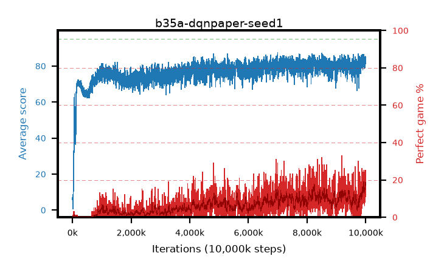

# b35a-dqnpaper-seed1

step **10,000,000** · 4000 evals · trailing **82.79** · peak **82.97** @9,947,500 · sef **0.0** · best30 **16.6** @9,987,500

## Config

| | |
|---|---|
| adam_epsilon | 0.0003125 |
| algo | dqn |
| batch_size | 32 |
| beta_anneal_steps | 300000 |
| collect_envs | 1 |
| discount | 0.99 |
| epsilon_anneal_steps | 250000 |
| epsilon_schedule | linear |
| eval_interval | 2500 |
| eval_queue | True |
| eval_queue_depth | 16 |
| eval_workers | 8 |
| fc_layers | (320,) |
| fork_branches | 1 |
| gradient_clipping | 0.0 |
| graph_eval_episodes | 100 |
| guided_fraction | 0.0 |
| init_from | None |
| initial_collect_steps | 20000 |
| initial_epsilon | 1.0 |
| is_beta | 0.4 |
| is_beta_final | 1.0 |
| is_weights | False |
| learning_rate | 5e-05 |
| max_steps | 10000000 |
| min_checkpoint_score | 40.0 |
| min_epsilon | 0.01 |
| munchausen_alpha | 0.0 |
| munchausen_l0 | -1.0 |
| munchausen_tau | 0.03 |
| n_step_update | 1 |
| priority_exponent | 0.0 |
| replay_buffer_max_length | 1000000 |
| replay_ratio | 0.25 |
| seed | 1 |
| target_update_period | 2000 |
| target_update_tau | 1.0 |
| torch_threads | 1 |

## Evals

| step | avg score | trailing avg | min score | max score | avg reward | perfect % | epsilon |
|---|---|---|---|---|---|---|---|
| 2500 | 7.05 | 7.05 | 0.0 | 21.0 | 5.713 | 0.0 | 0.9901 |
| 5000 | 5.41 | 6.23 | 0.0 | 18.0 | 4.811 | 0.0 | 0.9802 |
| 7500 | 5.89 | 4.96 | 0.0 | 19.0 | 5.273 | 0.0 | 0.9703 |
| ... | ... | ... | ... | ... | ... | ... | ... |
| 9972500 | 79.26 | 82.81 | 19.0 | 95.0 | 86.037 | 8.0 | 0.01 |
| 9975000 | 83.3 | 82.86 | 41.0 | 95.0 | 98.881 | 17.0 | 0.01 |
| 9977500 | 82.86 | 82.56 | 29.0 | 95.0 | 97.599 | 16.0 | 0.01 |
| 9980000 | 82.46 | 82.61 | 21.0 | 95.0 | 102.095 | 21.0 | 0.01 |
| 9982500 | 85.42 | 82.86 | 20.0 | 95.0 | 102.972 | 19.0 | 0.01 |
| 9985000 | 83.95 | 82.75 | 44.0 | 95.0 | 104.57 | 22.0 | 0.01 |
| 9987500 | 85.08 | 82.86 | 25.0 | 95.0 | 108.729 | 25.0 | 0.01 |
| 9990000 | 83.97 | 82.81 | 13.0 | 95.0 | 101.563 | 19.0 | 0.01 |
| 9992500 | 82.49 | 82.77 | 32.0 | 95.0 | 95.168 | 14.0 | 0.01 |
| 9995000 | 82.74 | 82.67 | 26.0 | 95.0 | 94.317 | 13.0 | 0.01 |
| 9997500 | 81.17 | 82.6 | 35.0 | 95.0 | 92.899 | 13.0 | 0.01 |
| 10000000 | 83.28 | 82.79 | 15.0 | 95.0 | 93.012 | 11.0 | 0.01 |
