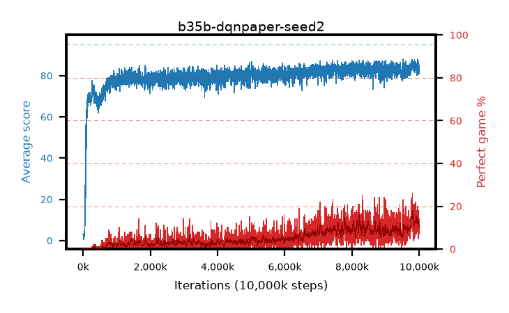

# b35b-dqnpaper-seed2

step **10,000,000** · 4000 evals · trailing **84.24** · peak **85.02** @9,822,500 · sef **0.0** · best30 **15.6** @9,822,500

## Config

| | |
|---|---|
| adam_epsilon | 0.0003125 |
| algo | dqn |
| batch_size | 32 |
| beta_anneal_steps | 300000 |
| collect_envs | 1 |
| discount | 0.99 |
| epsilon_anneal_steps | 250000 |
| epsilon_schedule | linear |
| eval_interval | 2500 |
| eval_queue | True |
| eval_queue_depth | 16 |
| eval_workers | 8 |
| fc_layers | (320,) |
| fork_branches | 1 |
| gradient_clipping | 0.0 |
| graph_eval_episodes | 100 |
| guided_fraction | 0.0 |
| init_from | None |
| initial_collect_steps | 20000 |
| initial_epsilon | 1.0 |
| is_beta | 0.4 |
| is_beta_final | 1.0 |
| is_weights | False |
| learning_rate | 5e-05 |
| max_steps | 10000000 |
| min_checkpoint_score | 40.0 |
| min_epsilon | 0.01 |
| munchausen_alpha | 0.0 |
| munchausen_l0 | -1.0 |
| munchausen_tau | 0.03 |
| n_step_update | 1 |
| priority_exponent | 0.0 |
| replay_buffer_max_length | 1000000 |
| replay_ratio | 0.25 |
| seed | 2 |
| target_update_period | 2000 |
| target_update_tau | 1.0 |
| torch_threads | 1 |

## Evals

| step | avg score | trailing avg | min score | max score | avg reward | perfect % | epsilon |
|---|---|---|---|---|---|---|---|
| 2500 | 3.02 | 3.02 | 1.0 | 9.0 | 2.464 | 0.0 | 0.9901 |
| 5000 | 2.79 | 2.91 | 0.0 | 7.0 | 2.232 | 0.0 | 0.9802 |
| 7500 | 2.26 | 2.69 | 0.0 | 10.0 | 1.703 | 0.0 | 0.9703 |
| ... | ... | ... | ... | ... | ... | ... | ... |
| 9972500 | 80.51 | 84.51 | 1.0 | 95.0 | 84.287 | 5.0 | 0.01 |
| 9975000 | 86.3 | 84.55 | 2.0 | 95.0 | 101.894 | 17.0 | 0.01 |
| 9977500 | 85.04 | 84.76 | 43.0 | 95.0 | 95.726 | 12.0 | 0.01 |
| 9980000 | 84.46 | 84.52 | 37.0 | 95.0 | 93.085 | 10.0 | 0.01 |
| 9982500 | 84.15 | 84.41 | 45.0 | 95.0 | 90.884 | 8.0 | 0.01 |
| 9985000 | 82.4 | 84.34 | 43.0 | 95.0 | 89.013 | 8.0 | 0.01 |
| 9987500 | 84.0 | 84.24 | 35.0 | 95.0 | 96.674 | 14.0 | 0.01 |
| 9990000 | 84.88 | 84.29 | 20.0 | 95.0 | 96.531 | 13.0 | 0.01 |
| 9992500 | 81.11 | 84.22 | 49.0 | 95.0 | 86.863 | 7.0 | 0.01 |
| 9995000 | 82.77 | 84.31 | 39.0 | 95.0 | 91.503 | 10.0 | 0.01 |
| 9997500 | 83.66 | 84.35 | 33.0 | 95.0 | 93.303 | 11.0 | 0.01 |
| 10000000 | 82.54 | 84.24 | 31.0 | 95.0 | 93.203 | 12.0 | 0.01 |
