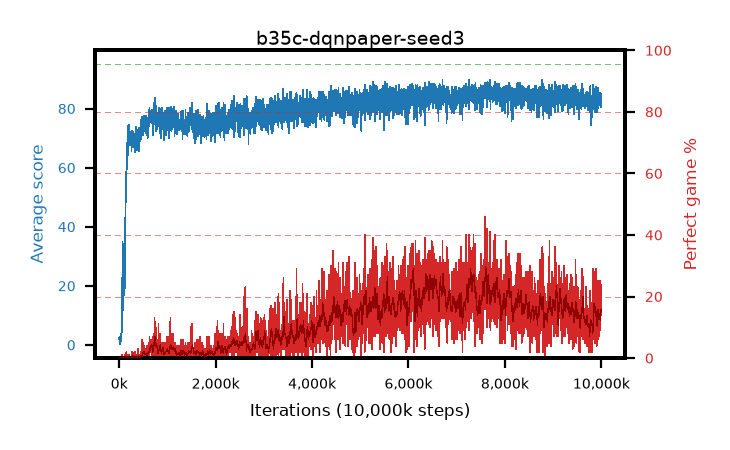

# b35c-dqnpaper-seed3

step **10,000,000** · 4000 evals · trailing **83.29** · peak **85.9** @7,635,000 · sef **0.0** · best30 **26.4** @6,100,000

## Config

| | |
|---|---|
| adam_epsilon | 0.0003125 |
| algo | dqn |
| batch_size | 32 |
| beta_anneal_steps | 300000 |
| collect_envs | 1 |
| discount | 0.99 |
| epsilon_anneal_steps | 250000 |
| epsilon_schedule | linear |
| eval_interval | 2500 |
| eval_queue | True |
| eval_queue_depth | 16 |
| eval_workers | 8 |
| fc_layers | (320,) |
| fork_branches | 1 |
| gradient_clipping | 0.0 |
| graph_eval_episodes | 100 |
| guided_fraction | 0.0 |
| init_from | None |
| initial_collect_steps | 20000 |
| initial_epsilon | 1.0 |
| is_beta | 0.4 |
| is_beta_final | 1.0 |
| is_weights | False |
| learning_rate | 5e-05 |
| max_steps | 10000000 |
| min_checkpoint_score | 40.0 |
| min_epsilon | 0.01 |
| munchausen_alpha | 0.0 |
| munchausen_l0 | -1.0 |
| munchausen_tau | 0.03 |
| n_step_update | 1 |
| priority_exponent | 0.0 |
| replay_buffer_max_length | 1000000 |
| replay_ratio | 0.25 |
| seed | 3 |
| target_update_period | 2000 |
| target_update_tau | 1.0 |
| torch_threads | 1 |

## Evals

| step | avg score | trailing avg | min score | max score | avg reward | perfect % | epsilon |
|---|---|---|---|---|---|---|---|
| 2500 | 1.99 | 1.99 | 0.0 | 5.0 | 1.435 | 0.0 | 0.9901 |
| 5000 | 2.59 | 2.29 | 0.0 | 14.0 | 2.033 | 0.0 | 0.9802 |
| 7500 | 1.97 | 2.18 | 0.0 | 8.0 | 1.417 | 0.0 | 0.9703 |
| ... | ... | ... | ... | ... | ... | ... | ... |
| 9972500 | 82.92 | 83.3 | 19.0 | 95.0 | 91.582 | 10.0 | 0.01 |
| 9975000 | 82.44 | 83.24 | 15.0 | 95.0 | 90.842 | 10.0 | 0.01 |
| 9977500 | 83.26 | 83.37 | 33.0 | 95.0 | 92.815 | 11.0 | 0.01 |
| 9980000 | 83.46 | 83.38 | 7.0 | 95.0 | 98.145 | 16.0 | 0.01 |
| 9982500 | 82.85 | 83.5 | 55.0 | 95.0 | 91.526 | 10.0 | 0.01 |
| 9985000 | 84.35 | 83.62 | 21.0 | 95.0 | 106.835 | 24.0 | 0.01 |
| 9987500 | 83.84 | 83.67 | 35.0 | 95.0 | 102.35 | 20.0 | 0.01 |
| 9990000 | 83.98 | 83.68 | 52.0 | 95.0 | 98.637 | 16.0 | 0.01 |
| 9992500 | 83.33 | 83.59 | 49.0 | 95.0 | 95.878 | 14.0 | 0.01 |
| 9995000 | 84.84 | 83.57 | 25.0 | 95.0 | 100.484 | 17.0 | 0.01 |
| 9997500 | 82.73 | 83.5 | 9.0 | 95.0 | 95.264 | 14.0 | 0.01 |
| 10000000 | 80.64 | 83.29 | 17.0 | 95.0 | 93.269 | 14.0 | 0.01 |
