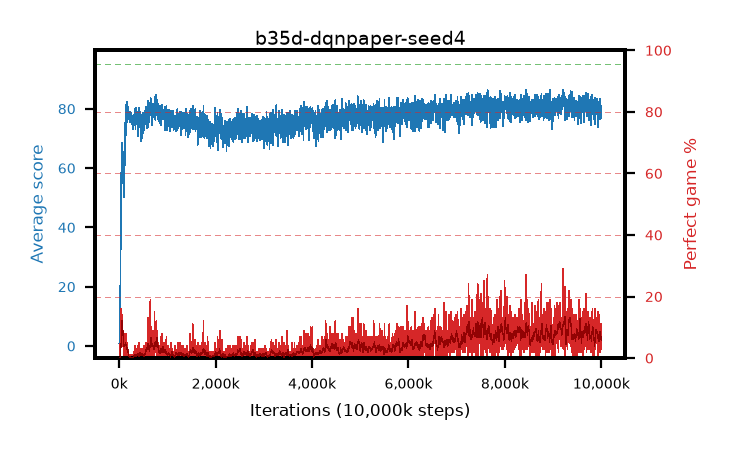

# b35d-dqnpaper-seed4

step **10,000,000** · 4000 evals · trailing **79.85** · peak **82.53** @9,245,000 · sef **0.0** · best30 **11.3** @9,245,000

## Config

| | |
|---|---|
| adam_epsilon | 0.0003125 |
| algo | dqn |
| batch_size | 32 |
| beta_anneal_steps | 300000 |
| collect_envs | 1 |
| discount | 0.99 |
| epsilon_anneal_steps | 250000 |
| epsilon_schedule | linear |
| eval_interval | 2500 |
| eval_queue | True |
| eval_queue_depth | 16 |
| eval_workers | 8 |
| fc_layers | (320,) |
| fork_branches | 1 |
| gradient_clipping | 0.0 |
| graph_eval_episodes | 100 |
| guided_fraction | 0.0 |
| init_from | None |
| initial_collect_steps | 20000 |
| initial_epsilon | 1.0 |
| is_beta | 0.4 |
| is_beta_final | 1.0 |
| is_weights | False |
| learning_rate | 5e-05 |
| max_steps | 10000000 |
| min_checkpoint_score | 40.0 |
| min_epsilon | 0.01 |
| munchausen_alpha | 0.0 |
| munchausen_l0 | -1.0 |
| munchausen_tau | 0.03 |
| n_step_update | 1 |
| priority_exponent | 0.0 |
| replay_buffer_max_length | 1000000 |
| replay_ratio | 0.25 |
| seed | 4 |
| target_update_period | 2000 |
| target_update_tau | 1.0 |
| torch_threads | 1 |

## Evals

| step | avg score | trailing avg | min score | max score | avg reward | perfect % | epsilon |
|---|---|---|---|---|---|---|---|
| 2500 | 0.85 | 0.85 | 0.0 | 8.0 | 0.296 | 0.0 | 0.9901 |
| 5000 | 1.03 | 0.94 | 0.0 | 10.0 | 0.473 | 0.0 | 0.9802 |
| 7500 | 0.93 | 0.94 | 0.0 | 5.0 | 0.373 | 0.0 | 0.9703 |
| ... | ... | ... | ... | ... | ... | ... | ... |
| 9972500 | 82.82 | 80.05 | 45.0 | 95.0 | 87.589 | 6.0 | 0.01 |
| 9975000 | 78.96 | 79.82 | 33.0 | 95.0 | 82.709 | 5.0 | 0.01 |
| 9977500 | 76.4 | 80.09 | 19.0 | 95.0 | 81.233 | 6.0 | 0.01 |
| 9980000 | 78.17 | 79.92 | 13.0 | 95.0 | 81.875 | 5.0 | 0.01 |
| 9982500 | 82.84 | 79.93 | 15.0 | 95.0 | 91.585 | 10.0 | 0.01 |
| 9985000 | 76.58 | 79.83 | 28.0 | 95.0 | 81.425 | 6.0 | 0.01 |
| 9987500 | 79.61 | 79.71 | 11.0 | 95.0 | 81.409 | 3.0 | 0.01 |
| 9990000 | 79.91 | 79.89 | 34.0 | 95.0 | 86.687 | 8.0 | 0.01 |
| 9992500 | 81.03 | 79.98 | 22.0 | 95.0 | 85.68 | 6.0 | 0.01 |
| 9995000 | 80.21 | 79.98 | 13.0 | 95.0 | 83.003 | 4.0 | 0.01 |
| 9997500 | 80.39 | 79.88 | 19.0 | 95.0 | 88.949 | 10.0 | 0.01 |
| 10000000 | 79.63 | 79.85 | 18.0 | 95.0 | 89.4 | 11.0 | 0.01 |
