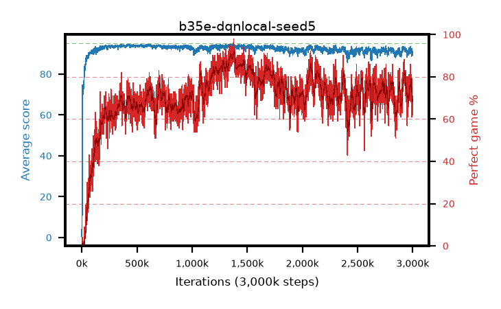

# b35e-dqnlocal-seed5

step **3,000,000** · 3000 evals · trailing **91.31** · peak **94.18** @433,000 · sef **22.7** · best30 **90.5** @1,383,000

## Config

| | |
|---|---|
| adam_epsilon | 1e-07 |
| algo | dqn |
| batch_size | 128 |
| beta_anneal_steps | 300000 |
| collect_envs | 1 |
| discount | 0.99 |
| epsilon_anneal_steps | 250000 |
| epsilon_schedule | eval |
| eval_interval | 1000 |
| eval_queue | True |
| eval_queue_depth | 16 |
| eval_workers | 8 |
| fc_layers | (320,) |
| fork_branches | 4 |
| fork_max_steps | 60 |
| fork_min_length | 85 |
| fork_prob | 0.5 |
| gradient_clipping | 0.0 |
| graph_eval_episodes | 100 |
| guided_fraction | 0.8 |
| init_from | None |
| initial_collect_steps | 2000 |
| initial_epsilon | 0.4 |
| is_beta | 0.4 |
| is_beta_final | 1.0 |
| is_weights | True |
| learning_rate | 1e-05 |
| max_steps | 3000000 |
| min_checkpoint_score | 40.0 |
| min_epsilon | 0.002 |
| munchausen_alpha | 0.0 |
| munchausen_l0 | -1.0 |
| munchausen_tau | 0.03 |
| n_step_update | 1 |
| priority_exponent | 0.6 |
| replay_buffer_max_length | 100000 |
| replay_ratio | 1.0 |
| seed | 5 |
| target_update_period | 8 |
| target_update_tau | 1.0 |
| torch_threads | 1 |

## Evals

| step | avg score | trailing avg | min score | max score | avg reward | perfect % | epsilon |
|---|---|---|---|---|---|---|---|
| 1000 | 0.61 | 0.61 | 0.0 | 4.0 | 0.056 | 0.0 | 0.4 |
| 2000 | 7.59 | 4.1 | 1.0 | 69.0 | 6.937 | 0.0 | 0.4 |
| 3000 | 13.31 | 7.17 | 1.0 | 90.0 | 12.532 | 0.0 | 0.4 |
| ... | ... | ... | ... | ... | ... | ... | ... |
| 2989000 | 92.08 | 91.47 | 72.0 | 95.0 | 163.605 | 74.0 | 0.00232 |
| 2990000 | 88.81 | 91.46 | 26.0 | 95.0 | 146.965 | 61.0 | 0.00227 |
| 2991000 | 92.49 | 91.51 | 75.0 | 95.0 | 162.984 | 73.0 | 0.00225 |
| 2992000 | 90.8 | 91.51 | 61.0 | 95.0 | 155.087 | 67.0 | 0.00224 |
| 2993000 | 91.95 | 91.52 | 50.0 | 95.0 | 168.693 | 79.0 | 0.00223 |
| 2994000 | 90.44 | 91.47 | 49.0 | 95.0 | 155.784 | 68.0 | 0.00225 |
| 2995000 | 90.69 | 91.47 | 54.0 | 95.0 | 156.034 | 68.0 | 0.00224 |
| 2996000 | 90.94 | 91.41 | 72.0 | 95.0 | 157.271 | 69.0 | 0.00224 |
| 2997000 | 91.04 | 91.41 | 75.0 | 95.0 | 152.172 | 64.0 | 0.00224 |
| 2998000 | 90.62 | 91.35 | 60.0 | 95.0 | 159.172 | 71.0 | 0.00224 |
| 2999000 | 89.21 | 91.19 | 46.0 | 95.0 | 148.34 | 62.0 | 0.00224 |
| 3000000 | 90.66 | 91.31 | 63.0 | 95.0 | 154.962 | 67.0 | 0.00227 |
