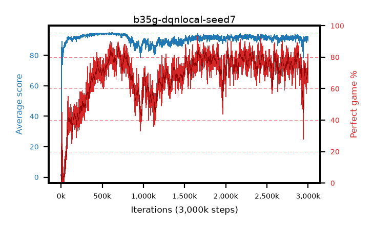

# b35g-dqnlocal-seed7

step **3,000,000** · 3000 evals · trailing **90.81** · peak **94.42** @588,000 · sef **20.3** · best30 **84.0** @708,000

## Config

| | |
|---|---|
| adam_epsilon | 1e-07 |
| algo | dqn |
| batch_size | 128 |
| beta_anneal_steps | 300000 |
| collect_envs | 1 |
| discount | 0.99 |
| epsilon_anneal_steps | 250000 |
| epsilon_schedule | eval |
| eval_interval | 1000 |
| eval_queue | True |
| eval_queue_depth | 16 |
| eval_workers | 8 |
| fc_layers | (320,) |
| fork_branches | 4 |
| fork_max_steps | 60 |
| fork_min_length | 85 |
| fork_prob | 0.5 |
| gradient_clipping | 0.0 |
| graph_eval_episodes | 100 |
| guided_fraction | 0.8 |
| init_from | None |
| initial_collect_steps | 2000 |
| initial_epsilon | 0.4 |
| is_beta | 0.4 |
| is_beta_final | 1.0 |
| is_weights | True |
| learning_rate | 1e-05 |
| max_steps | 3000000 |
| min_checkpoint_score | 40.0 |
| min_epsilon | 0.002 |
| munchausen_alpha | 0.0 |
| munchausen_l0 | -1.0 |
| munchausen_tau | 0.03 |
| n_step_update | 1 |
| priority_exponent | 0.6 |
| replay_buffer_max_length | 100000 |
| replay_ratio | 1.0 |
| seed | 7 |
| target_update_period | 8 |
| target_update_tau | 1.0 |
| torch_threads | 1 |

## Evals

| step | avg score | trailing avg | min score | max score | avg reward | perfect % | epsilon |
|---|---|---|---|---|---|---|---|
| 1000 | 0.83 | 0.83 | 0.0 | 5.0 | 0.273 | 0.0 | 0.4 |
| 2000 | 3.36 | 2.09 | 1.0 | 15.0 | 2.793 | 0.0 | 0.4 |
| 3000 | 4.61 | 2.93 | 1.0 | 28.0 | 4.036 | 0.0 | 0.4 |
| ... | ... | ... | ... | ... | ... | ... | ... |
| 2989000 | 91.16 | 90.61 | 55.0 | 95.0 | 161.674 | 73.0 | 0.00257 |
| 2990000 | 91.92 | 90.7 | 65.0 | 95.0 | 163.522 | 74.0 | 0.00258 |
| 2991000 | 90.73 | 90.72 | 58.0 | 95.0 | 157.187 | 69.0 | 0.00257 |
| 2992000 | 91.56 | 90.74 | 65.0 | 95.0 | 164.213 | 75.0 | 0.00259 |
| 2993000 | 92.2 | 90.82 | 57.0 | 95.0 | 166.901 | 77.0 | 0.00258 |
| 2994000 | 90.46 | 90.78 | 50.0 | 95.0 | 157.908 | 70.0 | 0.00256 |
| 2995000 | 90.96 | 90.76 | 48.0 | 95.0 | 159.389 | 71.0 | 0.00258 |
| 2996000 | 92.15 | 90.76 | 54.0 | 95.0 | 172.083 | 82.0 | 0.00258 |
| 2997000 | 89.4 | 90.73 | 65.0 | 95.0 | 150.684 | 64.0 | 0.00258 |
| 2998000 | 91.69 | 90.78 | 68.0 | 95.0 | 166.458 | 77.0 | 0.00256 |
| 2999000 | 92.09 | 90.84 | 22.0 | 95.0 | 164.626 | 75.0 | 0.00257 |
| 3000000 | 90.95 | 90.81 | 21.0 | 95.0 | 160.515 | 72.0 | 0.00256 |
