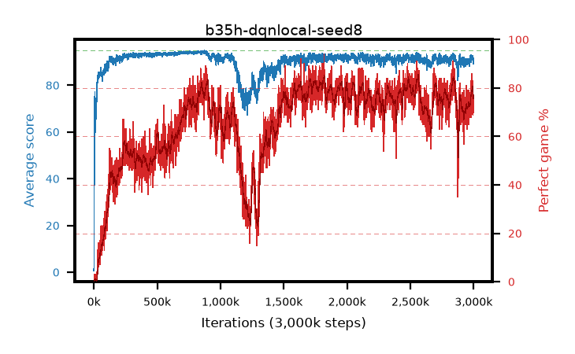

# b35h-dqnlocal-seed8

step **3,000,000** · 3000 evals · trailing **91.39** · peak **94.3** @844,000 · sef **19.2** · best30 **83.1** @2,565,000

## Config

| | |
|---|---|
| adam_epsilon | 1e-07 |
| algo | dqn |
| batch_size | 128 |
| beta_anneal_steps | 300000 |
| collect_envs | 1 |
| discount | 0.99 |
| epsilon_anneal_steps | 250000 |
| epsilon_schedule | eval |
| eval_interval | 1000 |
| eval_queue | True |
| eval_queue_depth | 16 |
| eval_workers | 8 |
| fc_layers | (320,) |
| fork_branches | 4 |
| fork_max_steps | 60 |
| fork_min_length | 85 |
| fork_prob | 0.5 |
| gradient_clipping | 0.0 |
| graph_eval_episodes | 100 |
| guided_fraction | 0.8 |
| init_from | None |
| initial_collect_steps | 2000 |
| initial_epsilon | 0.4 |
| is_beta | 0.4 |
| is_beta_final | 1.0 |
| is_weights | True |
| learning_rate | 1e-05 |
| max_steps | 3000000 |
| min_checkpoint_score | 40.0 |
| min_epsilon | 0.002 |
| munchausen_alpha | 0.0 |
| munchausen_l0 | -1.0 |
| munchausen_tau | 0.03 |
| n_step_update | 1 |
| priority_exponent | 0.6 |
| replay_buffer_max_length | 100000 |
| replay_ratio | 1.0 |
| seed | 8 |
| target_update_period | 8 |
| target_update_tau | 1.0 |
| torch_threads | 1 |

## Evals

| step | avg score | trailing avg | min score | max score | avg reward | perfect % | epsilon |
|---|---|---|---|---|---|---|---|
| 1000 | 0.65 | 0.65 | 0.0 | 5.0 | 0.096 | 0.0 | 0.4 |
| 2000 | 2.16 | 1.41 | 0.0 | 9.0 | 1.603 | 0.0 | 0.4 |
| 3000 | 57.66 | 20.16 | 1.0 | 92.0 | 56.378 | 0.0 | 0.4 |
| ... | ... | ... | ... | ... | ... | ... | ... |
| 2989000 | 92.03 | 91.09 | 37.0 | 95.0 | 169.896 | 80.0 | 0.00224 |
| 2990000 | 90.84 | 91.1 | 41.0 | 95.0 | 163.633 | 75.0 | 0.00223 |
| 2991000 | 90.8 | 91.1 | 30.0 | 95.0 | 165.545 | 77.0 | 0.00223 |
| 2992000 | 92.63 | 91.18 | 53.0 | 95.0 | 173.617 | 83.0 | 0.00221 |
| 2993000 | 92.51 | 91.25 | 41.0 | 95.0 | 173.596 | 83.0 | 0.00216 |
| 2994000 | 90.86 | 91.27 | 41.0 | 95.0 | 157.298 | 69.0 | 0.00216 |
| 2995000 | 91.29 | 91.27 | 54.0 | 95.0 | 164.005 | 75.0 | 0.00217 |
| 2996000 | 90.8 | 91.34 | 32.0 | 95.0 | 163.542 | 75.0 | 0.00217 |
| 2997000 | 89.17 | 91.46 | 43.0 | 95.0 | 157.909 | 71.0 | 0.00215 |
| 2998000 | 91.46 | 91.42 | 28.0 | 95.0 | 166.246 | 77.0 | 0.00214 |
| 2999000 | 89.63 | 91.4 | 49.0 | 95.0 | 157.399 | 70.0 | 0.00214 |
| 3000000 | 90.19 | 91.39 | 2.0 | 95.0 | 165.101 | 77.0 | 0.00214 |
