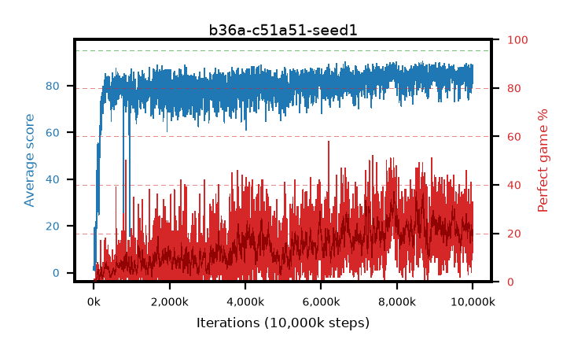

# b36a-c51a51-seed1

step **10,000,000** · 4000 evals · trailing **83.56** · peak **86.31** @7,932,500 · sef **0.0** · best30 **32.4** @7,945,000

## Config

| | |
|---|---|
| adam_epsilon | 0.0003125 |
| algo | c51 |
| batch_size | 32 |
| beta_anneal_steps | 300000 |
| collect_envs | 1 |
| discount | 0.99 |
| dist_atoms | 51 |
| dist_embedding | 64 |
| dist_fraction_entropy | 0.001 |
| dist_fraction_lr | 2.5e-09 |
| dist_kappa | 1.0 |
| dist_policy_samples | 32 |
| dist_quantiles | 32 |
| dist_risk_alpha | 1.0 |
| dist_risk_train | False |
| dist_tau_prime_samples | 64 |
| dist_tau_samples | 64 |
| dist_v_max | 110.0 |
| dist_v_min | -10.0 |
| epsilon_anneal_steps | 250000 |
| epsilon_schedule | linear |
| eval_interval | 2500 |
| eval_queue | True |
| eval_queue_depth | 16 |
| eval_workers | 8 |
| fc_layers | (320,) |
| fork_branches | 1 |
| gradient_clipping | 0.0 |
| graph_eval_episodes | 100 |
| guided_fraction | 0.0 |
| init_from | None |
| initial_collect_steps | 20000 |
| initial_epsilon | 1.0 |
| is_beta | 0.4 |
| is_beta_final | 1.0 |
| is_weights | False |
| learning_rate | 0.00025 |
| max_steps | 10000000 |
| min_checkpoint_score | 40.0 |
| min_epsilon | 0.01 |
| munchausen_alpha | 0.0 |
| munchausen_l0 | -1.0 |
| munchausen_tau | 0.03 |
| n_step_update | 1 |
| priority_exponent | 0.0 |
| replay_buffer_max_length | 1000000 |
| replay_ratio | 0.25 |
| seed | 1 |
| target_update_period | 2000 |
| target_update_tau | 1.0 |
| torch_threads | 1 |

## Evals

| step | avg score | trailing avg | min score | max score | avg reward | perfect % | epsilon |
|---|---|---|---|---|---|---|---|
| 2500 | 1.01 | 1.01 | 0.0 | 7.0 | 0.453 | 0.0 | 0.9901 |
| 5000 | 3.3 | 2.15 | 0.0 | 31.0 | 2.705 | 0.0 | 0.9802 |
| 7500 | 2.77 | 2.07 | 0.0 | 71.0 | 2.175 | 0.0 | 0.9703 |
| ... | ... | ... | ... | ... | ... | ... | ... |
| 9972500 | 84.48 | 83.24 | 41.0 | 95.0 | 106.197 | 23.0 | 0.01 |
| 9975000 | 81.8 | 83.08 | 27.0 | 95.0 | 95.579 | 15.0 | 0.01 |
| 9977500 | 86.14 | 83.31 | 37.0 | 95.0 | 110.854 | 26.0 | 0.01 |
| 9980000 | 82.08 | 83.26 | 29.0 | 95.0 | 89.888 | 9.0 | 0.01 |
| 9982500 | 81.05 | 83.27 | 35.0 | 95.0 | 90.854 | 11.0 | 0.01 |
| 9985000 | 83.71 | 83.3 | 45.0 | 95.0 | 105.449 | 23.0 | 0.01 |
| 9987500 | 85.47 | 83.24 | 36.0 | 95.0 | 111.194 | 27.0 | 0.01 |
| 9990000 | 82.84 | 83.35 | 45.0 | 95.0 | 94.634 | 13.0 | 0.01 |
| 9992500 | 88.73 | 83.69 | 65.0 | 95.0 | 120.401 | 33.0 | 0.01 |
| 9995000 | 85.09 | 83.42 | 48.0 | 95.0 | 107.809 | 24.0 | 0.01 |
| 9997500 | 86.62 | 83.54 | 25.0 | 95.0 | 116.307 | 31.0 | 0.01 |
| 10000000 | 81.02 | 83.56 | 12.0 | 95.0 | 91.82 | 12.0 | 0.01 |
