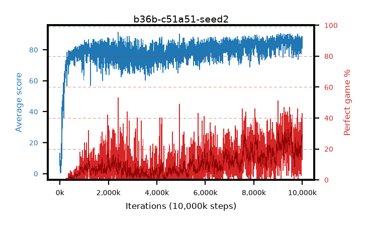

# b36b-c51a51-seed2

step **10,000,000** · 4000 evals · trailing **85.08** · peak **86.96** @9,550,000 · sef **0.0** · best30 **30.3** @9,537,500

## Config

| | |
|---|---|
| adam_epsilon | 0.0003125 |
| algo | c51 |
| batch_size | 32 |
| beta_anneal_steps | 300000 |
| collect_envs | 1 |
| discount | 0.99 |
| dist_atoms | 51 |
| dist_embedding | 64 |
| dist_fraction_entropy | 0.001 |
| dist_fraction_lr | 2.5e-09 |
| dist_kappa | 1.0 |
| dist_policy_samples | 32 |
| dist_quantiles | 32 |
| dist_risk_alpha | 1.0 |
| dist_risk_train | False |
| dist_tau_prime_samples | 64 |
| dist_tau_samples | 64 |
| dist_v_max | 110.0 |
| dist_v_min | -10.0 |
| epsilon_anneal_steps | 250000 |
| epsilon_schedule | linear |
| eval_interval | 2500 |
| eval_queue | True |
| eval_queue_depth | 16 |
| eval_workers | 8 |
| fc_layers | (320,) |
| fork_branches | 1 |
| gradient_clipping | 0.0 |
| graph_eval_episodes | 100 |
| guided_fraction | 0.0 |
| init_from | None |
| initial_collect_steps | 20000 |
| initial_epsilon | 1.0 |
| is_beta | 0.4 |
| is_beta_final | 1.0 |
| is_weights | False |
| learning_rate | 0.00025 |
| max_steps | 10000000 |
| min_checkpoint_score | 40.0 |
| min_epsilon | 0.01 |
| munchausen_alpha | 0.0 |
| munchausen_l0 | -1.0 |
| munchausen_tau | 0.03 |
| n_step_update | 1 |
| priority_exponent | 0.0 |
| replay_buffer_max_length | 1000000 |
| replay_ratio | 0.25 |
| seed | 2 |
| target_update_period | 2000 |
| target_update_tau | 1.0 |
| torch_threads | 1 |

## Evals

| step | avg score | trailing avg | min score | max score | avg reward | perfect % | epsilon |
|---|---|---|---|---|---|---|---|
| 2500 | 13.24 | 3.41 | 0.0 | 85.0 | 12.361 | 0.0 | 0.9901 |
| 5000 | 2.66 | 2.66 | 0.0 | 8.0 | 2.081 | 0.0 | 0.9802 |
| 7500 | 2.39 | 2.53 | 1.0 | 10.0 | 1.817 | 0.0 | 0.9703 |
| ... | ... | ... | ... | ... | ... | ... | ... |
| 9972500 | 86.45 | 84.03 | 43.0 | 95.0 | 118.172 | 33.0 | 0.01 |
| 9975000 | 88.39 | 84.51 | 47.0 | 95.0 | 116.962 | 30.0 | 0.01 |
| 9977500 | 87.34 | 83.84 | 39.0 | 95.0 | 121.003 | 35.0 | 0.01 |
| 9980000 | 82.97 | 83.75 | 40.0 | 95.0 | 100.703 | 19.0 | 0.01 |
| 9982500 | 86.45 | 83.8 | 39.0 | 95.0 | 119.14 | 34.0 | 0.01 |
| 9985000 | 86.99 | 84.19 | 22.0 | 95.0 | 115.666 | 30.0 | 0.01 |
| 9987500 | 85.49 | 84.75 | 4.0 | 95.0 | 113.135 | 29.0 | 0.01 |
| 9990000 | 88.58 | 84.42 | 50.0 | 95.0 | 130.238 | 43.0 | 0.01 |
| 9992500 | 84.93 | 84.92 | 19.0 | 95.0 | 100.67 | 17.0 | 0.01 |
| 9995000 | 80.97 | 84.78 | 31.0 | 95.0 | 92.563 | 13.0 | 0.01 |
| 9997500 | 83.88 | 84.79 | 24.0 | 95.0 | 104.544 | 22.0 | 0.01 |
| 10000000 | 85.59 | 85.08 | 39.0 | 95.0 | 114.263 | 30.0 | 0.01 |
